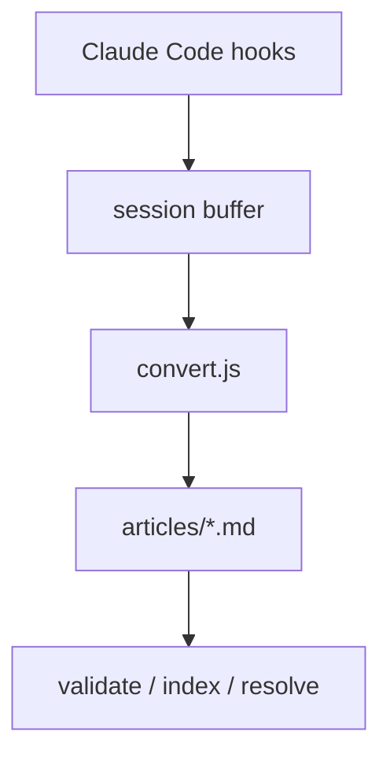
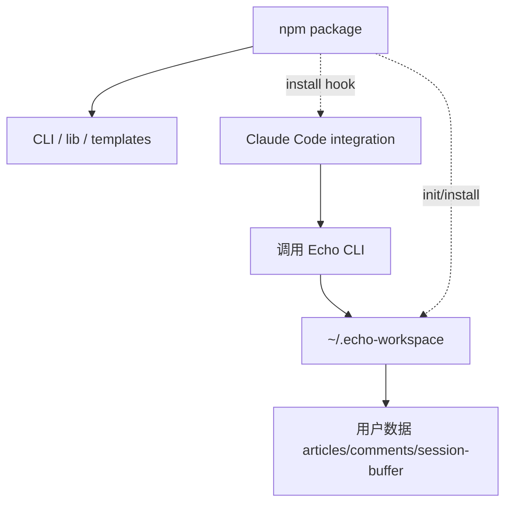
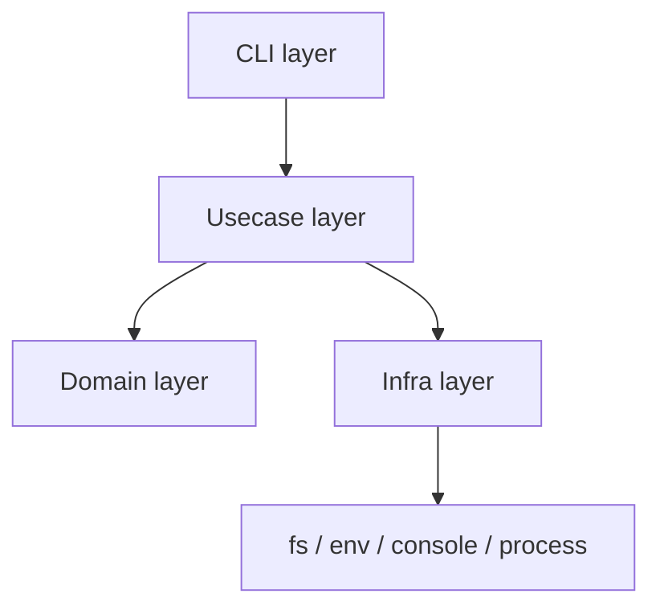
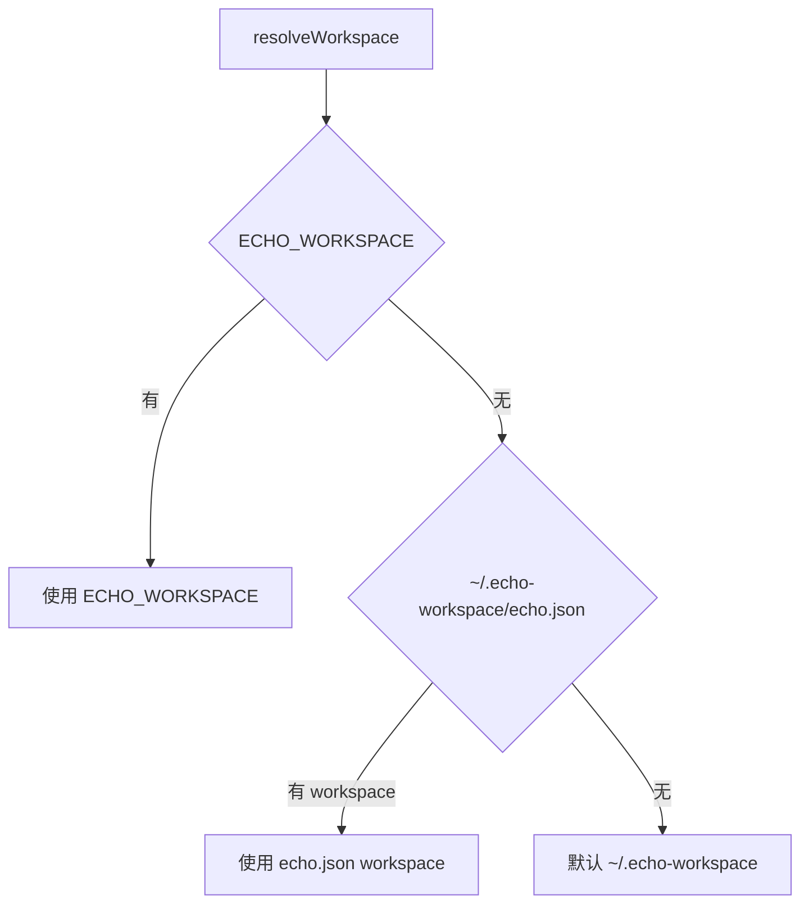
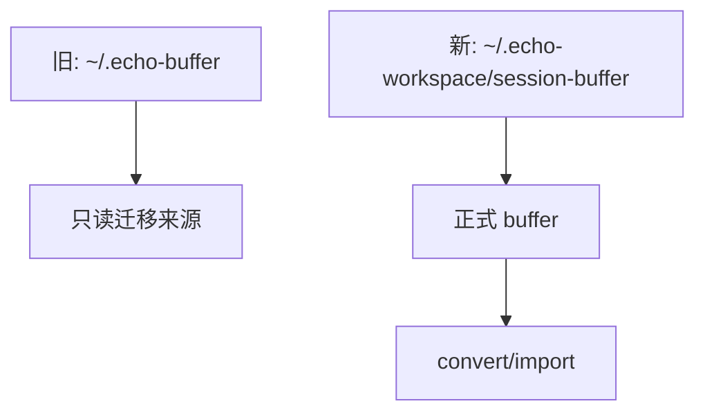
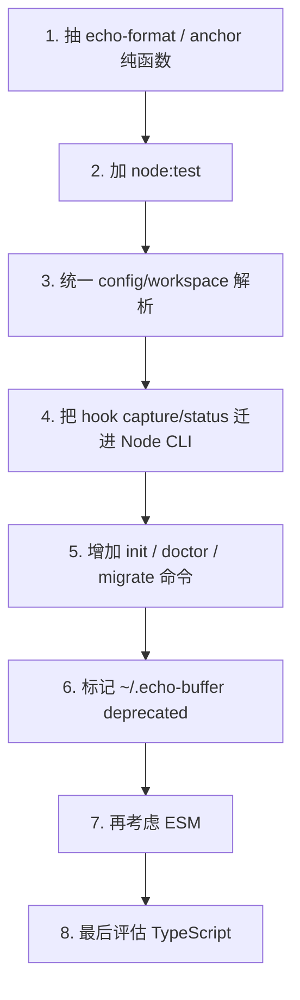

# Echo 工程边界与 npm 发布改造说明

本文档整理 2026-05-21 与 Codex 讨论后的工程判断，供 Claude Code 后续执行。目标不是重写产品，而是把当前可运行原型收束成可测试、可发布、可维护的 npm CLI 项目。

---

## 1. 当前判断

Echo 现在已经跑通核心链路，但整体仍偏“脚本原型”。



主要瓶颈不是 CommonJS 或 TypeScript，而是：

| 问题 | 判断 | 优先级 |
|---|---|---:|
| 没有测试 | 最大瓶颈。现有 `validate/resolve` 是数据校验，不是行为测试 | P0 |
| 没有工程边界 | CLI、业务逻辑、配置、文件系统副作用混在一起 | P0 |
| 配置分散 | Node 脚本和 hook 脚本各自解析路径/env | P0 |
| hook 不可发布 | 当前 hook 指向用户本机绝对路径，不能随 npm 包稳定分发 | P0 |
| CommonJS | 影响 IDE 跳转体验，但不是第一根因 | P1 |
| TypeScript | 有价值，但不应第一步全量迁移 | P2 |

阶段性原则：

```text
先让函数可测，再让模块可跳，再让类型可约束。
```

---

## 2. 目标边界

未来 Echo 应拆成三层：



| 边界 | 应该包含 | 不应该包含 |
|---|---|---|
| npm package | CLI、业务函数、配置解析、hook 适配命令、模板 | 用户数据、用户本机绝对路径 |
| `~/.echo-workspace` | articles、comments、session-buffer、echo.json | 源码、npm 包文件 |
| Claude Code hook | 调用 Echo CLI | 内嵌大量业务逻辑 |
| `~/.claude/settings.json` | 用户显式安装后的 hook 配置 | npm install 时自动覆盖 |

---

## 3. 推荐目录结构

先保持 JS，不急着上 TS。

```text
echo-prototype/
  bin/
    echo-mcp.js

  scripts/
    cli/
      convert.js
      validate.js
      index.js
      resolve.js
      annotate.js
      search.js

    lib/
      domain/
        echo-format.js
        anchor.js
        validation.js
        annotation.js

      usecases/
        convert-buffer.js
        validate-workspace.js
        create-annotation.js
        search-articles.js

      infra/
        config.js
        workspace.js
        markdown-store.js
        hook-input.js

      hooks/
        capture.js
        status.js

  test/
    echo-format.test.js
    anchor.test.js
    validation.test.js
    workspace.test.js

  templates/
    claude/
      settings-snippet.json
```

---

## 4. 代码层边界规则



| 层 | 负责 | 禁止 |
|---|---|---|
| CLI | 参数解析、打印、exit code | 写业务规则 |
| Usecase | 串联读取、转换、校验、写入 | 直接解析 argv/env |
| Domain | 纯函数、格式转换、锚点解析、校验规则 | `fs`、`process`、`console` |
| Infra | workspace、config、文件读写、hook stdin | 决定业务规则 |

优先拆分对象：

| 当前文件 | 优先抽出的纯函数 |
|---|---|
| `scripts/lib/echo-format.js` | 已接近 domain，可先加测试 |
| `scripts/resolve.js` | `stripInlineFormatting`、`findAllPositions`、`resolveAnchor` |
| `scripts/annotate.js` | 参数解析、文章加载、锚点定位、annotation 构造分离 |
| `scripts/validate.js` | 校验规则变成可测试函数 |
| `scripts/convert.js` | `parseBuffer`、`buildArticle`、写入策略分离 |

---

## 5. Workspace 与配置边界

当前 canonical workspace 是：

```text
~/.echo-workspace
```

当前 canonical buffer 是：

```text
~/.echo-workspace/session-buffer
```

统一解析规则：



要求：

- 所有 Node 脚本必须通过同一个 `resolveWorkspace()`。
- hook 逻辑也必须走同一套解析，不要在 shell 里自己拼路径。
- `echo.json` 建议使用 `~/.echo-workspace` 这种可移植写法，不写死 `/Users/...`。
- `.env.example` 可以提供默认项，但真正配置来源应集中到 `config.js`。

建议支持的配置项：

| 配置 | 用途 |
|---|---|
| `ECHO_WORKSPACE` | 覆盖 workspace 根目录 |
| `ECHO_CAPTURE` | 临时关闭/开启 hook 捕获 |
| `ECHO_USER_SPEAKER` | 默认 human speaker |
| `ECHO_AI_SPEAKER` | 默认 AI speaker |
| `ECHO_BUFFER_DIR` | 高级调试覆盖，不推荐普通用户使用 |

---

## 6. `~/.echo-buffer` 的处理

`~/.echo-buffer` 是旧版 Claude Code hook 留下的缓冲目录。它不应继续作为产品路径。



决策：

| 路径 | 状态 | 处理 |
|---|---|---|
| `~/.echo-buffer` | legacy | deprecated，只读迁移来源 |
| `~/.echo-workspace/session-buffer` | canonical | 保留，hook 默认写入 |

后续命令建议：

```bash
echo-mcp doctor
echo-mcp migrate legacy-buffer
```

迁移策略：

| 文件 | 处理 |
|---|---|
| `session-*.md` | 导入或复制到 `~/.echo-workspace/session-buffer/legacy/` |
| `pending/*.json` | 不自动导入，只提示存在孤儿 pending |
| `debug-last-input.json` | 不迁移 |
| `session-map.txt` | 不迁移 |
| `failures.jsonl` | 可归档到 `session-buffer/legacy/failures.jsonl` |

---

## 7. Hook 发布策略

当前问题：

```text
~/.claude/settings.json -> bash /Users/vincenthuang/.claude/hooks/echo-capture.sh
```

这在本机可用，但不能作为 npm 发布形态。

推荐改为：

```text
~/.claude/settings.json -> echo-mcp hook capture
~/.claude/settings.json -> echo-mcp hook status
```


要求：

- `.sh` 不再承载核心逻辑。
- `.sh` 如保留，只能作为兼容包装或模板。
- `hook capture` 从 stdin 读取 Claude hook JSON。
- `hook status` 从 workspace / project status 生成 SessionStart 输出。
- 不允许 npm `postinstall` 自动修改 `~/.claude/settings.json`。

建议命令：

```bash
echo-mcp init
echo-mcp hook install claude
echo-mcp hook install claude --write
echo-mcp hook doctor
echo-mcp hook capture
echo-mcp hook status
```

安装策略：

| 命令 | 行为 |
|---|---|
| `echo-mcp init` | 创建 workspace、写 `echo.json`、创建目录 |
| `echo-mcp hook install claude` | 打印建议配置，不写用户文件 |
| `echo-mcp hook install claude --write` | 用户显式授权后修改 Claude 配置 |
| `echo-mcp hook doctor` | 检查 hook 是否存在、路径是否旧、workspace 是否可写 |

---

## 8. 测试策略

先用 Node 内置测试框架：

```bash
node --test
```

package script：

```json
{
  "scripts": {
    "test": "node --test",
    "verify": "npm run test && npm run validate && npm run resolve"
  }
}
```

优先测试：

| 模块 | 边界条件 |
|---|---|
| `echo-format` | 空内容、已有前缀、AI/human、未知 model、标题截断 |
| `anchor` | quote 找不到、多次出现、prefix/suffix 消歧、line_hint 兜底 |
| `validation` | 缺字段、重复 ID、引用不存在、evolution cycle |
| `workspace` | `ECHO_WORKSPACE`、`~` 展开、config 缺失、目录不存在 |
| `hook capture` | UserPromptSubmit、Stop、StopFailure、capture off、无 pending |

注意：

- `validate` 和 `resolve` 是数据校验，不等于测试。
- 测试不要写真实 `~/.echo-workspace`，必须使用临时目录。

---

## 9. CommonJS / ESM / TypeScript 决策

短期：

- 不立刻全量 TS。
- 不先做大规模 ESM 迁移。
- 先抽边界和测试。

中期：

- 业务函数抽出来后，可迁移 ESM。
- 使用 JSDoc 描述核心结构。

长期：

- 当数据结构稳定后再评估 TS。
- TS 重点约束这些类型：
  - `Article`
  - `Turn`
  - `Annotation`
  - `WorkspaceConfig`
  - `HookInput`

---

## 10. 建议执行顺序



第一阶段验收标准：

| 项目 | 标准 |
|---|---|
| 测试 | `npm run test` 可跑，覆盖 `echo-format` 和 `anchor` |
| 数据校验 | `npm run validate`、`npm run resolve` 继续通过 |
| workspace | 所有脚本只通过统一 resolver 获取路径 |
| hook | 新增 Node hook 入口，不再依赖 `.sh` 的业务逻辑 |
| legacy | `~/.echo-buffer` 不再被新代码写入 |

---

## 11. 不要做的事

- 不要直接删除用户的 `~/.echo-buffer`。
- 不要 npm install 时自动改 `~/.claude/settings.json`。
- 不要第一步就全量 TypeScript。
- 不要在 domain 函数里读写文件。
- 不要把本机绝对路径写进模板。
- 不要让 hook 和 Node 脚本各自维护一套 workspace 解析逻辑。

