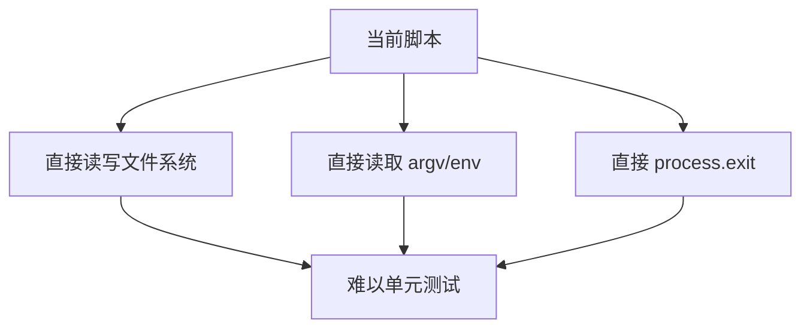
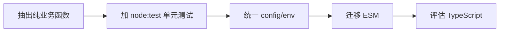

# Echo 验证清单

运行环境：`cd ~/myNote/echo-prototype`

---

## 1. 全管线

```bash
npm run all
```

**预期：** 所有步骤 `unchanged — skipped` 或 `OK`，结尾 `9 ok, 0 broken`。

---

## 2. 全文搜索

```bash
npm run search -- --keyword "Echo"
```

**预期：** ~11 条结果，每条带文件名、日期、上下文片段。

---

## 3. 标签搜索

```bash
npm run search -- --tag "AI"
```

**预期：** 1 条结果（`为什么你应该把 AI 对话存下来`）。

---

## 4. 组合搜索

```bash
npm run search -- --keyword "知识" --tag "AI"
```

**预期：** 1 条结果，同时匹配关键词和标签。

---

## 5. 无结果搜索

```bash
npm run search -- --keyword "xyzzy_nonexistent"
```

**预期：** `No results for keyword="xyzzy_nonexistent".`

---

## 6. 工作区目录结构

```bash
ls ~/.echo-workspace/
ls ~/.echo-workspace/articles/
ls ~/.echo-workspace/comments/
ls ~/.echo-workspace/session-buffer/
```

**预期：** 每个目录都有文件。

---

## 7. 评论文件内容

```bash
cat ~/.echo-workspace/comments/ann-001.md
```

**预期：** 看到 YAML frontmatter（`---` 包裹的字段） + 评论正文。

---

## 8. SessionStart 通知

下次新开会话时看终端输出。应该显示：

```
Echo: 13 done | 自动记录 开启中 | echo capture off 暂停
```

---

## 9. 测试关闭捕获（可选）

```bash
ECHO_CAPTURE=off echo "这行说明捕获已跳过"
```

**预期：** 不写入 session-buffer。下次会话自动恢复（env 只影响当前进程）。

---

## 10. Git 历史

```bash
git log --oneline -5
```

**预期：** 最近提交依次是搜索 → 捕获开关 → 工作区系统 → 初始提交。

---

有问题随时回来讨论。

---

## 11. 工程化判断记录

当前项目已经能跑通核心流程，但整体还偏“脚本原型”，主要瓶颈不是某一个语法选择，而是工程边界还没有建立。



优先级判断：

| 问题 | 判断 | 优先级 |
|---|---|---:|
| 没有测试 | 最大瓶颈。`validate/resolve` 是数据校验，不是行为测试 | P0 |
| 没有边界 | 根因。CLI、业务逻辑、配置、文件系统副作用混在一起 | P0 |
| 没有 `.env` | 是配置边界缺失的表现，需要补 `.env.example` 和统一配置入口 | P1 |
| CommonJS | 会影响可读性和 IDE 跳转体验，但不是第一根因 | P1 |
| TypeScript | 有价值，但不建议第一步就上 | P2 |

建议改造顺序：



关于 TypeScript：

- 现在不建议立刻全量迁移 TS。当前项目规模小，最大问题是边界和测试；直接上 TS 容易把问题变成“配置和编译问题”。
- 建议先用 JS + JSDoc + `node:test` 建立可测试边界。
- 当数据结构稳定后，再考虑 TS，重点类型包括 `Article`、`Turn`、`Annotation`、`WorkspaceConfig`。
- 如果后续要做长期 CLI 工具、插件化、更多输入源，TS 会明显有价值。

阶段性目标：

```text
先让函数可测，再让模块可跳，再让类型可约束。
```
