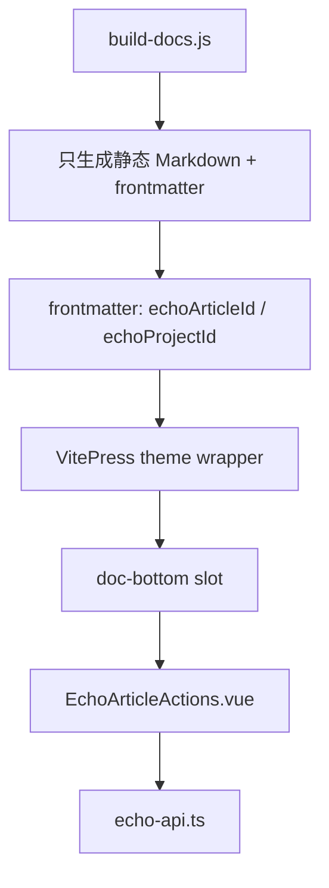

# VitePress Vue 组件化重构方案

日期：2026-05-25

## 背景

`build-docs.js` 当前用 `echoClientScript()` 生成一段内联 `<script>`，负责文章页上的 capture 开关、MCP 配置按钮、文内选区评论、底部评论提交等交互。

这能作为热修复，但不是长期形态：

- 业务逻辑藏在字符串里，可读性和可测试性差。
- DOM 挂载时机容易踩坑，曾导致文章详情页点击后变成 VitePress 404。
- 每篇文章重复注入脚本，和 VitePress/Vue 的组件模型不一致。
- 交互功能继续增长后，`build-docs.js` 会混杂数据生成、页面结构、前端状态和 API 调用。

结论：**不 fork VitePress，不改 VitePress 源码。用官方 Vue/theme 扩展点重构。**

## 官方能力

VitePress 官方文档支持这条路线：

| 能力 | Echo 用法 |
|------|----------|
| Markdown 会被编译成 Vue SFC | 文章页可直接使用 Vue 组件 |
| `enhanceApp({ app })` | 注册全局 Echo 组件 |
| 默认主题 Layout slots | 用 `doc-bottom` / `doc-after` 注入文章交互区 |
| 自定义 theme 扩展默认主题 | 保留 VitePress 默认文档体验，只加 Echo 功能 |

参考：

- https://vitepress.dev/guide/using-vue
- https://vitepress.dev/guide/extending-default-theme
- https://vitepress.dev/reference/default-theme-layout

## 目标架构



## 文件职责

| 文件 | 职责 |
|------|------|
| `scripts/build-docs.js` | 生成不可变文章页面、索引、标签页、侧栏；不再生成内联交互脚本 |
| `docs/.vitepress/theme/index.ts` | 扩展默认主题，注册 Echo 组件 |
| `docs/.vitepress/theme/Layout.vue` | 包装 `DefaultTheme.Layout`，在 `doc-bottom` 注入 Echo 交互组件 |
| `docs/.vitepress/theme/components/EchoArticleActions.vue` | capture 开关、MCP 配置、文章级评论 |
| `docs/.vitepress/theme/components/EchoSelectionComment.vue` | 文内选区评论弹窗 |
| `docs/.vitepress/theme/lib/echo-api.ts` | 封装 `/api/capture`、`/api/comments`、`/api/mcp-config` |

## 页面数据模型

生成文章时在 frontmatter 写入 Echo 元数据：

```yaml
---
title: "..."
echo:
  articleId: session-2026-05-25
  projectId: null
  interactive: true
---
```

Vue 组件通过 `useData()` 读取：

```ts
const { frontmatter } = useData()
const articleId = computed(() => frontmatter.value.echo?.articleId)
```

这样交互组件不需要从 DOM 反推文章 ID。

## 实施步骤

1. 新增 `EchoArticleActions.vue`，先搬迁底部评论、capture 开关、MCP 配置。
2. 新增 `Layout.vue`，通过 `doc-bottom` slot 只在 `frontmatter.echo.interactive === true` 时显示交互组件。
3. 新增 `echo-api.ts`，集中处理 API 地址、fetch、错误提示。
4. 从 `build-docs.js` 删除 `echoClientScript()`，生成文章时只写 frontmatter 和静态 HTML/Markdown。
5. 再拆 `EchoSelectionComment.vue`，用 Vue `onMounted/onUnmounted` 管理 selection 事件。
6. Browser 回归：文章列表、三篇详情页、capture 开关、MCP 配置、底部评论、选区评论。
7. 跑 `npm test`、`npm run docs:build`、`npm run all`。

## 验收标准

- `build-docs.js` 不再包含大段内联 `<script>` 字符串。
- 文章正文仍保持不可变，重构只影响展示层和交互层。
- 文章详情页点击不会 404。
- API 未运行时，组件显示明确的不可用状态，不影响文章阅读。
- `npm test`、`npm run docs:build`、`npm run all` 通过。

## 不做

- 不 fork VitePress。
- 不修改 `node_modules/vitepress`。
- 不把文章正文变成可编辑页面。
- 不把评论写回文章正文；仍写入 comments/annotation 外部层。
