# 005 - Echo 产品界面与交互设计备忘

## 背景

这份文档记录 2026-05-24 的一轮产品讨论。原则是：先讨论清楚，再落文档，最后再改代码。

当前 Echo 已经具备：

```text
hook 捕获 -> buffer -> articles/comments -> VitePress 展示 -> MCP 只读查询
```

下一阶段问题集中在产品表层：用户如何命名、搜索、安装 MCP、控制采集、按项目浏览，以及如何在文章里留下批注。

## 总览

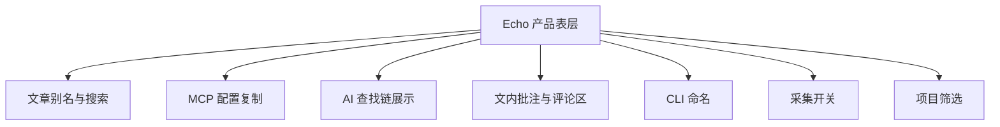

## 1. 文章别名进入数据模型

当前临时方案是 `article-aliases.json`，只影响 VitePress 展示。长期更合理的方案是把别名纳入文章 frontmatter。

建议字段：

```yaml
id: session-2026-05-22
title: “/understand-anything:understand --language zh”
alias: “幂等是什么：一次和两次为什么一样”
summary: “...”
```

显示规则：

| 场景 | 字段优先级 |
|------|------------|
| 页面 H1 | `alias` -> `title` -> `id` |
| 侧边栏 | `alias` -> `title` -> `id` |
| 首页/文章列表 | `alias` -> `title` -> `id` |
| 原始会话来源 | 保留 `title` 或正文首轮命令 |

搜索规则：

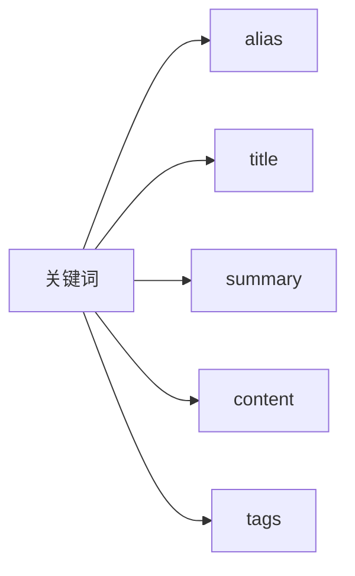

关键决定：

- `alias` 是人类可读标题，不替代原始命令。
- `title` 保留原始来源，尤其是命令式会话标题。
- MCP 和网页搜索都应该查 alias，避免只有展示层知道别名。

### 1.1 实施设计

**核心策略：** frontmatter 成为唯一来源，废弃 `article-aliases.json`。

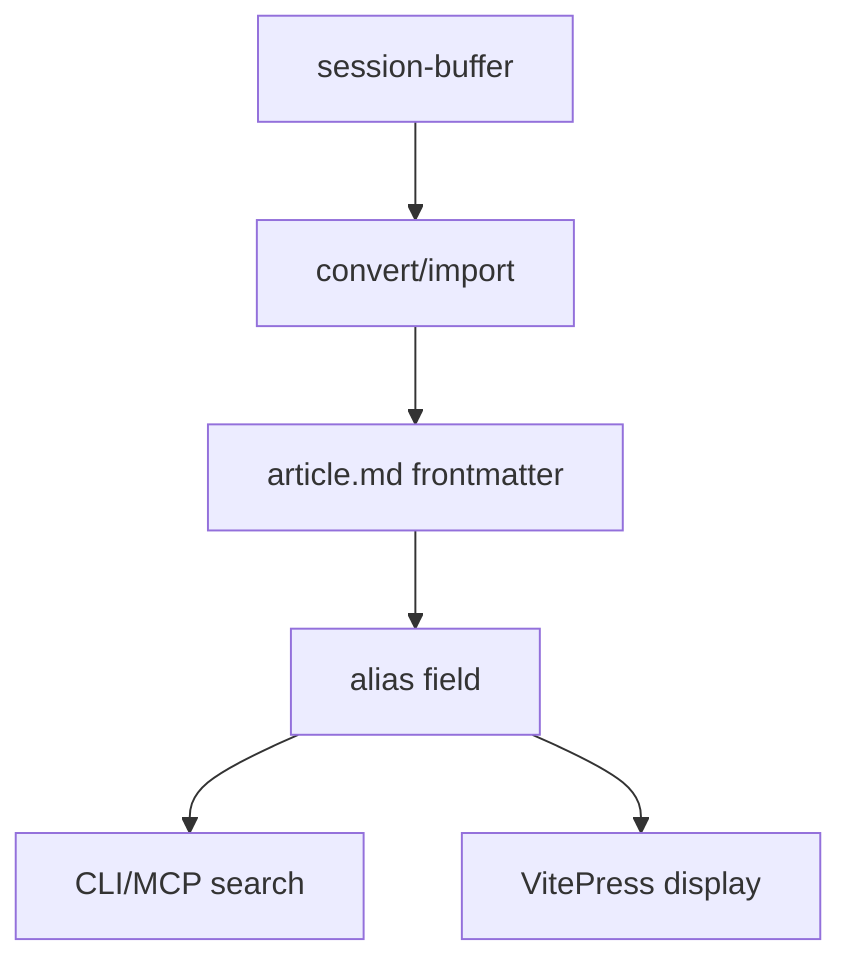

**convert/import 时默认写 alias：**

```yaml
title: 原始推断标题
alias: 原始推断标题    # 默认与 title 相同；用户后续手动改为人类可读标题
```

用户改展示名只改 `alias` frontmatter 字段，不改正文（符合不可变约束）。

**文件修改：**

| 文件 | 改动 |
|------|------|
| `scripts/lib/domain/echo-format.js` | `createArticle()` 接收 `alias`；`toMarkdown()` 序列化 `alias` |
| `scripts/lib/usecases/convert-buffer.js` | `buildArticle()` 写 `alias`（默认用推断 title） |
| `scripts/import-sessions.js` | `buildArticle()` 写 `alias` |
| `scripts/build-docs.js` | 删除 `ARTICLE_ALIASES_FILE` / `loadArticleAliases`；`displayTitle()` 读 frontmatter `alias \|\| title \|\| id` |
| `scripts/search.js` | keyword 搜索扩展为 `alias + title + id + body` |
| `scripts/lib/usecases/query-articles.js` | MCP 搜索同样覆盖 alias |
| `article-aliases.json` | 删除；存量数据一次性 migration（已有 alias → 写回对应文章 frontmatter） |

**边界情况：**

| 情况 | 处理 |
|------|------|
| 老文章无 alias | 展示回退到 title |
| alias 为空字符串 | 当无 alias |
| alias 修改 | 只改 frontmatter（合法，正文不可变但 frontmatter 可改） |
| migration JSON 中有未知 id | 报 warning，不创建新文章 |

---

## 2. 页面增加 MCP 配置按钮

用户希望网页上有一个”配置 MCP”按钮，点击后复制配置，由用户自行安装。

目标体验：


示例配置：

```json
{
  “mcpServers”: {
    “echo”: {
      “command”: “echoctl”,
      “args”: [“mcp”]
    }
  }
}
```

需要说明：

| 前提 | 说明 |
|------|------|
| CLI 已安装 | 用户机器上必须能运行 `echoctl` |
| 不自动写配置 | 网页只复制配置，不替用户改 Claude/Codex 配置 |
| 兼容旧命令 | 迁移期可继续给出 `echo-mcp` 版本 |

### 2.1 实施设计

**核心策略：** `echoctl serve` 提供 `GET /api/mcp-config` 返回 JSON，前端展示 + 复制按钮。不写用户文件。

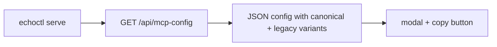

**文件修改：**

| 文件 | 改动 |
|------|------|
| `scripts/serve.js` | 新增 `GET /api/mcp-config` endpoint，返回 `{ canonical: { command, args }, legacy: { command, args } }` |
| `docs/.vitepress/theme/` 或生成脚本 | 注入 MCP 配置按钮和复制逻辑 |

**边界情况：**

| 情况 | 处理 |
|------|------|
| CLI 未安装 | 按钮仍显示配置；用户需自行 `npm link` |
| serve 未启动 | 按钮不可用，页面提示需要 `echoctl serve` |

---

## 3. AI 通过 MCP 查询时，网页展示查找链

当前 MCP 数据流：

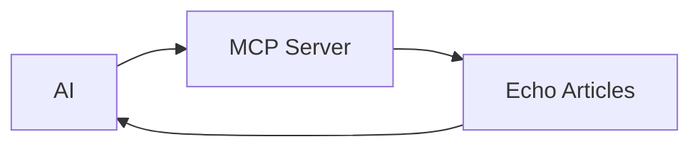

网页不知道 AI 查了哪些文章。若要显示查找链，需要 MCP 写查询日志：

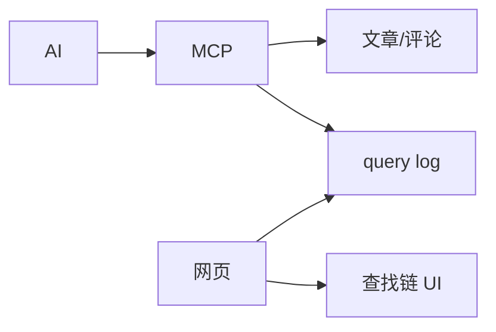

日志草案：

```json
{
  "time": "2026-05-24T00:00:00Z",
  "client": "claude",
  "tool": "search_articles",
  "query": "幂等",
  "results": ["session-2026-05-22"]
}
```

开放问题：

| 问题 | 说明 |
|------|------|
| 当前页面如何关联一次 MCP 查询 | 可以按结果包含当前 article id 来关联 |
| 是否需要会话 ID | 精准关联需要 AI/MCP 带 session/page id，复杂度更高 |
| 是否实时 | 可先轮询 query log，后续再考虑 SSE/WebSocket |

建议阶段：

| 阶段 | 范围 |
|------|------|
| v1 | 全局最近 MCP 查询日志 |
| v2 | 当前文章相关查询链 |
| v3 | 按 AI 会话精确关联当前页面 |

### 3.1 实施设计

**核心策略：** MCP `tools/call` 每次记录 JSONL，`echoctl serve` 提供读 log API。不引入数据库。

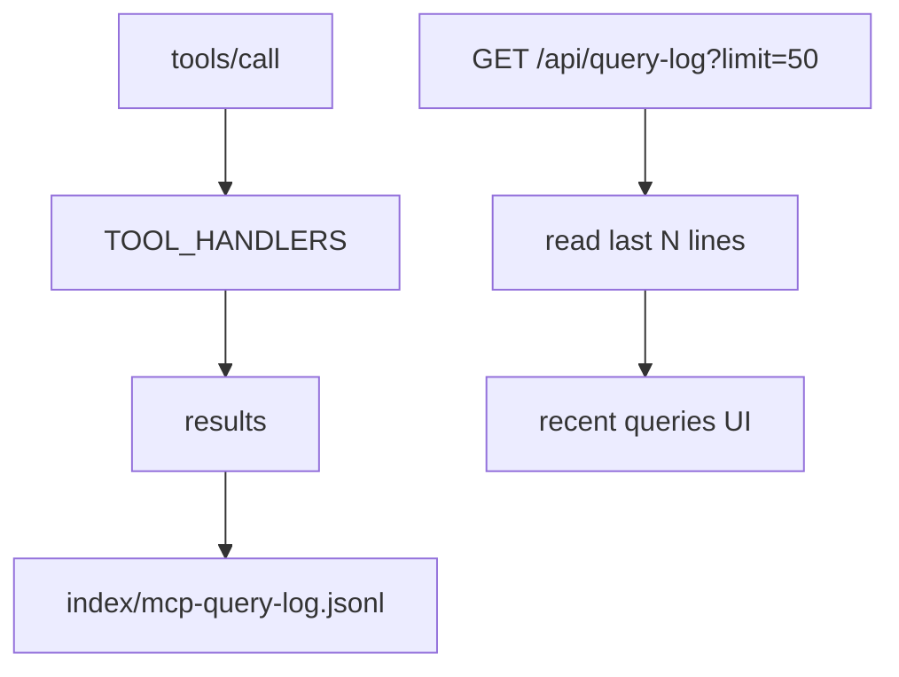

**Log 格式（每行一条 JSON）：**
```json
{ "time": "2026-05-25T12:34:56.000Z", "tool": "search_articles", "args": { "keyword": "alias" }, "ok": true, "result_count": 5, "duration_ms": 12 }
```

不记录完整文章正文结果，只记摘要，避免 log 膨胀和隐私重复。

**文件修改：**

| 文件 | 改动 |
|------|------|
| **新增** `scripts/lib/infra/query-log.js` | `appendQueryLog(dirs, entry)` — 追加 JSONL；`readRecentQueryLog(dirs, limit)` — tail 读取 |
| `scripts/lib/interfaces/mcp/server.js` | `tools/call` 包一层计时 + log |
| `scripts/serve.js` | `GET /api/query-log?limit=50` |
| `docs/` 生成脚本或前端组件 | 读取 `/api/query-log` 渲染"最近查询"区域 |

**性能考虑：**

| 风险 | 处理 |
|------|------|
| 高频查询 | `appendFileSync` 对 MCP 调用频率足够 |
| log 变大 | 读取只 tail 最后 N KB |
| 写失败 | 不影响 MCP 返回，只 `console.error` |
| 多项目 | v1 写项目内 log；v2 聚合到 `~/.echo-workspace/index/` |

**边界情况：**

| 情况 | 处理 |
|------|------|
| log 文件不存在 | 返回空数组 |
| serve 未启动时 MCP 仍可用 | log 独立于 serve；serve 只做读 |
| 不同 MCP 工具 | 统一记录 `tool + args + result_count + ok` |

## 4. 文内选区评论

目标：用户选中一段文字后，出现气泡或浮层，输入评论；保存后正文对应片段出现高亮/标识，底部评论区同步显示。

交互：

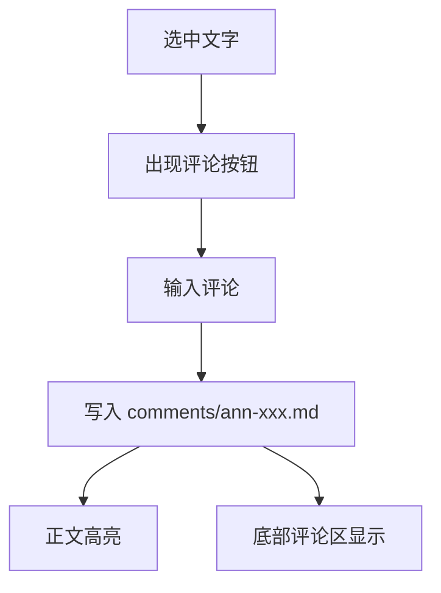

评论锚点建议继续沿用现有模型：

```yaml
target:
  article_id: session-2026-05-22
anchor:
  quote: "幂等只保证一件事"
  prefix: "..."
  suffix: "..."
  occurrence: 1
author: vincent
```

视觉建议：

| 位置 | 表现 |
|------|------|
| 被批注文字 | 淡色背景 |
| 段落旁边 | 小编号或评论标记 |
| 点击标记 | 展开对应评论 |
| 底部评论区 | 显示同一条评论卡片 |

关键点：

- 文章正文不可变（immutable）。文章是 AI 对话转写，等同于已发表内容。即使是作者本人，也不在网页端修改正文。
- 文内评论只写 `comments/`，不改文章正文。
- 锚点只需处理重复文本消歧义，不需要处理正文变动后的漂移（正文不变，锚点永远有效）。
- 前端展示层面的 Markdown 渲染差异不影响锚点解析（`stripInlineFormatting` 已处理 `**bold**` 等格式标记）。

### 4.1 实施设计

**核心策略：** 把 `annotate.js` 核心逻辑抽成 usecase `write-comment.js`，CLI 和 web API 共用。

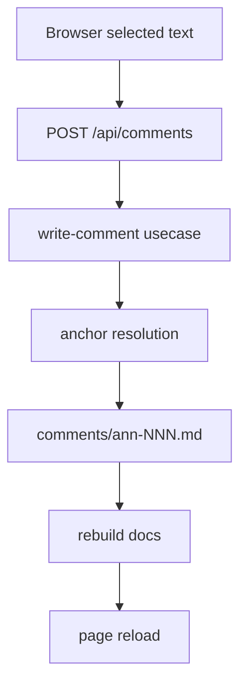

**API payload（文内批注）：**
```json
{
  "articleId": "session-2026-05-19",
  "quote": "selected text", "prefix": "...", "suffix": "...",
  "occurrence": 1, "comment": "my note", "author": "vincent"
}
```

**API payload（文章级评论）：**
```json
{
  "articleId": "session-2026-05-19",
  "comment": "whole article note", "author": "vincent",
  "scope": "article"
}
```

**Anchor 验证：** 服务端必须重新验证，不信任浏览器。`scope: article` 时不要求 quote/prefix/suffix/occurrence/line_hint。对应 `validation.js` 需支持两种 anchor kind。

**页面刷新：** v1 最简单：API 写 comment → 调 `runBuildDocs()` → 前端 `location.reload()`。v2 加局部刷新。

**文件修改：**

| 文件 | 改动 |
|------|------|
| **新增** `scripts/lib/usecases/write-comment.js` | 核心写入逻辑：验证 article、计算 anchor、生成 ann-NNN、写文件 |
| `scripts/annotate.js` | CLI 改为调用 `writeComment()` |
| `scripts/lib/domain/validation.js` | 支持 article-level comment（`anchor.kind === "article"` 时不要求 quote） |
| `scripts/build-docs.js` | 渲染 article-level comment 时不显示 quote block；渲染 inline comment 时显示高亮标记 |
| `scripts/serve.js` | `POST /api/comments` — 调 usecase + rebuild docs |
| 前端脚本 | 选中文字 → 弹出评论面板 → POST → 刷新 |

**边界情况：**

| 情况 | 处理 |
|------|------|
| quote 找不到 | 422，不写文件 |
| quote 多次出现 | 优先 occurrence；仍不唯一则 409 ambiguous |
| 空评论 | 400 |
| 并发写 ann id | `nextAnnotationId()` 后写前检查；冲突重试一次 |
| article-level comment 无 quote | 允许，anchor.kind = "article" |

---

## 5. 底部评论区输入框

底部评论区需要支持直接输入评论。它与文内批注不同，是文章级评论。

评论类型建议：

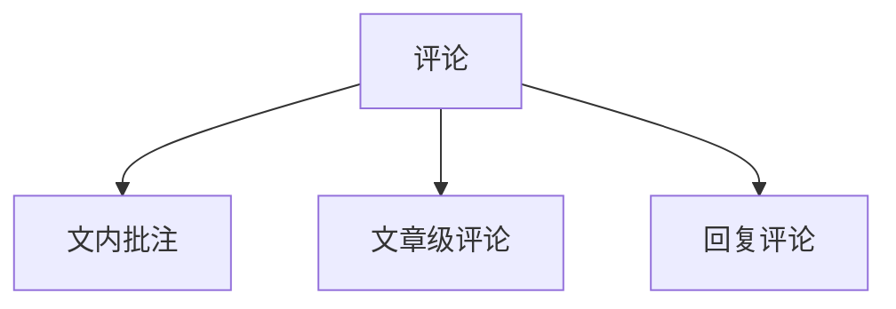

| 类型 | 是否有 quote | 显示位置 |
|------|--------------|----------|
| 文内批注 | 有 | 正文高亮 + 评论区 |
| 文章级评论 | 无 | 底部评论区 |
| 回复评论 | 可无 quote | 评论卡片下方 |

后续想法可以在这里继续扩展，例如评论回复链、评论转文章、评论进入进化链。

### 5.1 实施设计

**核心策略：** 底部评论输入框复用第 4 节的 `writeComment` usecase，只是 payload 里 `scope: "article"`。

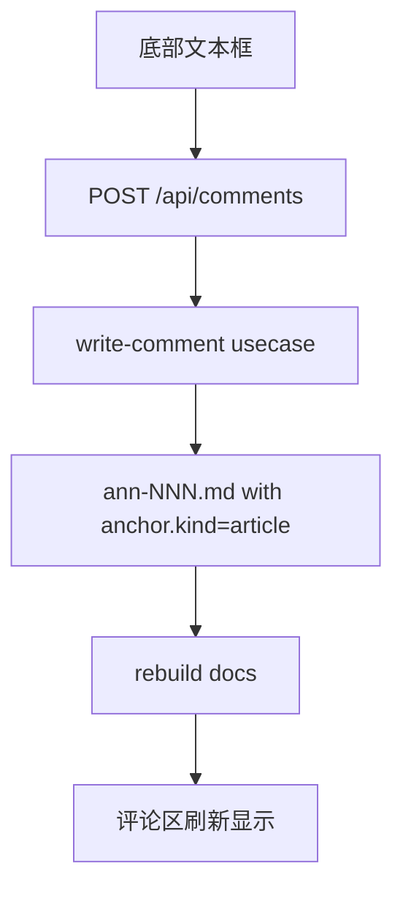

**文件修改：**

| 文件 | 改动 |
|------|------|
| `scripts/build-docs.js` | 文章页底部注入评论输入组件 |
| 前端脚本 | 底部输入框 + 提交按钮 |
| `scripts/serve.js` | 同上 `POST /api/comments`（第 4 节已覆盖） |

**边界情况：**

| 情况 | 处理 |
|------|------|
| 空评论 | 400 |
| 作者名 | 从 `echo.json` 读取；前端可显示当前作者 |
| 连续提交 | 无 rate limit（本地工具，不需要） |

## 6. CLI 命名：从 `echo-mcp` 迁移到 `echoctl`

### 6.1 背景与决策

`echo` 是 Unix/macOS/Linux 的系统级命令，不适合占用。

讨论过的候选：

| 命令 | 评价 |
|------|------|
| `echo` | 冲突太大，不用 |
| `echo-mcp` | 太窄，只像 MCP 子工具 |
| `echocli` | 直白但普通 |
| `echokb` | 知识库感明确，但 echoknowledgebase.com 已被 WordPress 插件占用 |
| `echoctl` | 工程感强，稳定。echoctl.com 被一家 DevOps 公司占用，但 CLI/npm 层面无实质冲突 |

决策：**`echoctl` 为 canonical 名，`echo-mcp` 为兼容别名。** 域名冲突不影响 CLI 包名。

### 6.2 命名设计：canonical + aliases 策略

不搞单一 `CLI_NAME` 常量，用结构化命名配置：

```js
// scripts/lib/cli/names.js

const cliNames = {
  canonicalName: "echoctl",
  legacyNames: ["echo-mcp"],
};

const mcpServerInfo = {
  name: "echo-mcp",          // 稳定产品名，不跟 CLI 命令走
  version: "0.2.0",
};

function commandFor(args) {
  return [cliNames.canonicalName, ...args].join(" ");
}

function allCliNames() {
  return [cliNames.canonicalName, ...cliNames.legacyNames];
}

function isKnownCliCommand(command) {
  if (typeof command !== "string") return false;
  return allCliNames().some((name) => command === name || command.startsWith(`${name} `));
}

module.exports = {
  cliNames,
  mcpServerInfo,
  commandFor,
  allCliNames,
  isKnownCliCommand,
};
```

核心规则：

| 规则 | 原因 |
|------|------|
| canonical 唯一 | 所有 usage/help/doctor 修复建议只显示 canonical 名 |
| legacy 保留 | 已安装的旧 hook 仍然有效，doctor 识别但不报 deprecated |
| 不推导 `process.argv` | 展示名只来自配置，避免别名行为漂移 |
| MCP `serverInfo.name` 解耦 | 保持 `echo-mcp`，已是稳定标识，换名会破坏客户端识别 |

### 6.3 实施计划

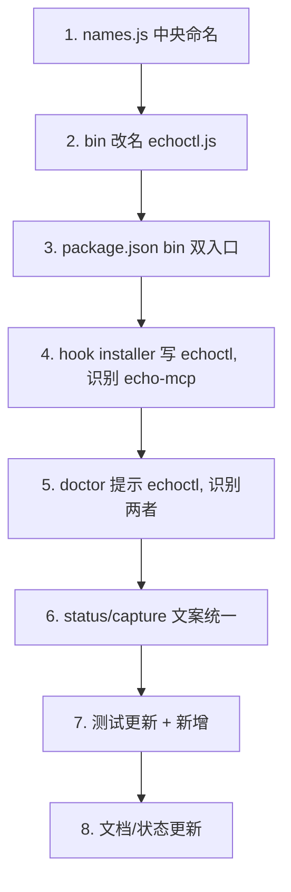

| 步骤 | 文件 | 变更 |
|------|------|------|
| 1 | **新增** `scripts/lib/cli/names.js` | 中央命名模块（见 6.2） |
| 2 | `bin/echo-mcp.js` → `bin/echoctl.js` | `git mv` 改名；usage/error 文案改用 `commandFor(...)` 或 `cliNames.canonicalName`；不推导 `process.argv` |
| 3 | `package.json` | `bin` 改为 `{ "echoctl": "./bin/echoctl.js", "echo-mcp": "./bin/echoctl.js" }`；`"mcp"` 脚本改成 `node bin/echoctl.js mcp` |
| 3b | `package-lock.json` | 同步 bin 条目，避免 install/link 不一致 |
| 4 | `scripts/lib/usecases/install-claude-hook.js` | `DESIRED_HOOKS` 改为 `echoctl hook capture/status`；检测已安装用 `isKnownCliCommand`，旧 `echo-mcp` 不重复安装 |
| 5 | `scripts/lib/usecases/run-doctor.js` | 修复提示改成 `echoctl ...`；hook 检测从 `startsWith("echo-mcp")` 改成 `isKnownCliCommand`；CLI 检查文案改为 `echoctl is in PATH; echo-mcp remains supported as alias` |
| 6 | `scripts/lib/hooks/status.js` | `captureHint` 从 `echo capture off` 改成用 `commandFor(["capture", "off"])` |
| 6b | `scripts/lib/interfaces/mcp/server.js` | `SERVER_INFO` 从 `mcpServerInfo` 导入，值保持不变；stderr 文案可改成 `[echoctl]` 但不改 `name` 字段 |
| 7 | `test/install-hook.test.js` | 断言 fresh install 写 `echoctl`；新增旧 `echo-mcp` 被识别且不重复添加的测试 |
| 7b | `test/run-doctor.test.js` | 保留旧 hook OK 测试；新增 `echoctl` hook OK 测试；更新提示文案断言 |
| 7c | `test/mcp-server.test.js` | 保持 `serverInfo.name === "echo-mcp"` 不变（防回归） |
| 7d | **新增** `test/cli-names.test.js` | `commandFor`、`isKnownCliCommand`、`allCliNames` 边界测试 |
| 8 | `README.md`、`USAGE_GUIDE_V3.md`、`ENGINEERING_BOUNDARIES.md`、`ECHO_STATUS.md` | 主推 `echoctl`；兼容说明保留 `echo-mcp`。生成文章（`docs/articles/generated/*`）不改正文 |

### 6.4 迁移策略

| 阶段 | 策略 |
|------|------|
| v1 | 新增 `echoctl` bin（`echo-mcp` 为 npm alias，指向同一文件）；installer 写 `echoctl`；doctor 识别两者 |
| v2 | 所有文档主推 `echoctl`；`echo-mcp` 仅在兼容说明中出现 |
| v3 | （远期）`echo-mcp` 执行时提示迁移，不中断功能 |

### 6.5 静默破坏风险

| 风险 | 处理 |
|------|------|
| 旧 `echo-mcp` hook + 新 `echoctl` hook 同时存在 → 重复捕获 | installer 必须把 `echo-mcp hook capture` 视为已安装，不追加第二条 |
| `npm link` 后旧全局 shim 指向已删除文件 | npm bin 双入口都指向 `bin/echoctl.js`；重新 `npm link` 后验证 |
| MCP 客户端按 `serverInfo.name` 识别服务器 | 锁定 `echo-mcp` 不变，测试覆盖 |
| 文案残留 `echo-mcp` 或 `echo capture` | `run-doctor.js`、`status.js`、CLI usage 全部走 `names.js` |
| `process.argv` 推导命令名 | 禁止；canonical 名只来自 `names.js` |
| 测试中断言 `echo-mcp` 字符串 | 分两类改：canonical 路径断言 `echoctl`；兼容路径保留 `echo-mcp` 并追加 `echoctl` 测试 |

### 6.6 验证清单

1. `npm test` — 全部通过（含新增 CLI names 测试）
2. `npm run all` — 管线通过
3. `npm link && which echoctl && which echo-mcp` — 两个命令都存在
4. `echoctl doctor` — 正常输出
5. `echo-mcp doctor` — 兼容别名正常输出（usage 显示 `echoctl` 可接受）
6. `echoctl mcp` — MCP server 启动，`serverInfo.name` 仍为 `echo-mcp`
7. 空 settings 装 hook → 写入 `echoctl` 命令
8. 已有 `echo-mcp` hook → doctor 报 OK，不重复写入

---

## 7. 页面增加”收集数据”开/关 + `echoctl serve` 本地 API

网页需要能控制当前的 capture 状态，对应 CLI：

```bash
echoctl capture status
echoctl capture on
echoctl capture off
```

目标 UI：

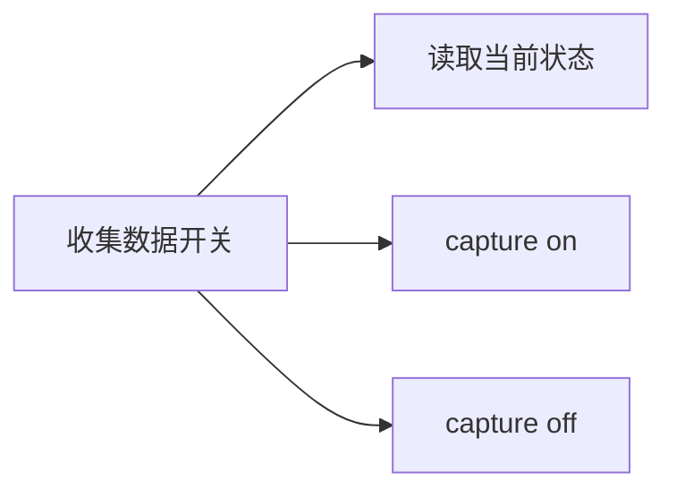

限制：静态 VitePress 页面不能直接执行本地命令。因此需要本地 API 服务。

### 7.1 实施设计：`echoctl serve`

**架构决策：** 不用 Express。Node `http` 模块即可。单父进程 + VitePress child process。

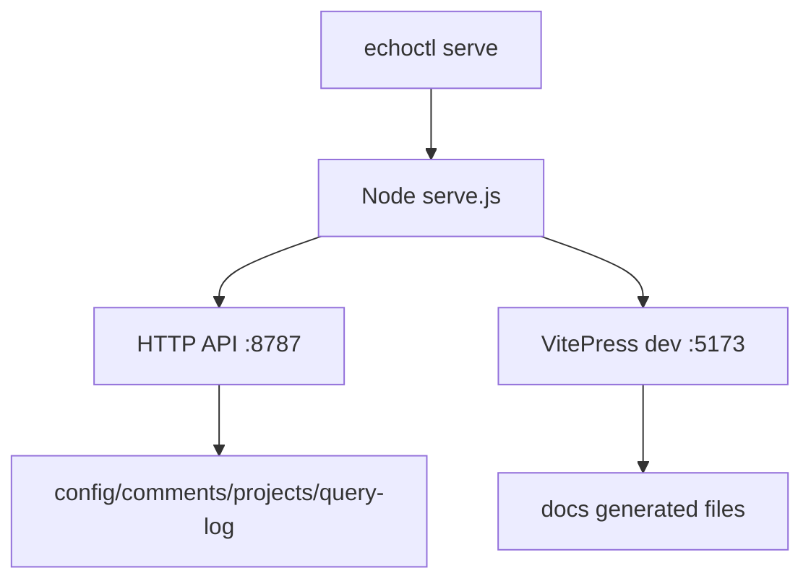

父进程启动顺序：
1. 先 `runBuildDocs()` 生成最新文档
2. 找空闲 API port（默认 8787，冲突自动 +1）
3. 找空闲 docs port（默认 5173，冲突自动 +1）
4. `spawn(“npx”, [“vitepress”, “dev”, “../docs”, “--port”, docsPort])`
5. 监听 HTTP 请求
6. SIGINT/SIGTERM → 关闭 API 和 VitePress child

**API endpoint 一览：**

| Method | Path | 说明 | 依赖模块 |
|--------|------|------|----------|
| `GET` | `/api/capture` | 返回 `{ enabled: bool }` | `config.isCaptureEnabled()` |
| `POST` | `/api/capture` | 接收 `{ enabled: bool }`，写入 echo.json | `config.setCaptureEnabled()` |
| `POST` | `/api/comments` | 写评论（inline 或 article-level） | `write-comment` usecase（第 4 节） |
| `GET` | `/api/projects` | 返回所有已注册项目列表 | `project-registry` |
| `GET` | `/api/mcp-config` | 返回 MCP 配置 JSON（canonical + legacy 版本） | `names.js` |
| `GET` | `/api/query-log?limit=50` | 最近 MCP 查询 | `query-log`（第 3 节） |
| `POST` | `/api/rebuild-docs` | 手动触发 rebuild | `build-docs.js` |

**端口策略：**

| 项 | 默认 | 冲突处理 |
|---|---:|---|
| API | `8787` | 自动 +1 |
| VitePress | `5173` | 自动 +1 |
| Host | `127.0.0.1` | 不监听公网 |

**文件修改：**

| 文件 | 改动 |
|------|------|
| **新增** `scripts/serve.js` | HTTP server + VitePress child process 管理；路由分发；CORS 仅允许 localhost |
| `bin/echo-mcp.js` → `bin/echoctl.js` | 新增 `serve` 子命令 |
| `echo-prototype/package.json` | 新增 `”serve”: “node bin/echoctl.js serve”` 脚本 |

**边界情况：**

| 情况 | 处理 |
|------|------|
| API port 被占用 | 自动找下一个空闲 port，日志输出实际 port |
| VitePress 启动失败 | 父进程退出，打印 child stderr |
| malformed JSON | `400 { error: “...” }` |
| 非本地 Origin | 默认 reject |
| comment 写后页面过期 | API 内部调 `runBuildDocs()` → VitePress HMR 自动刷新 |
| serve 未启动时 capture/comment 操作 | 不可用；页面提示需 `echoctl serve` |

---

## 8. 按项目显示对话，保留”全部”

目标：统一归档所有项目，但网页可以按项目筛选。

推荐模型：

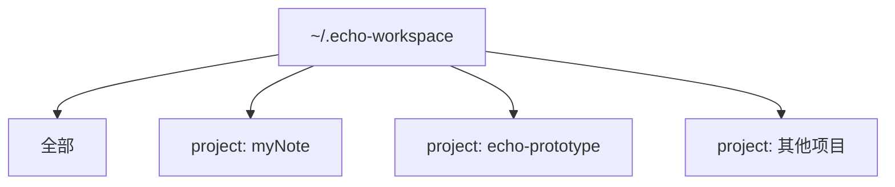

关键决定：

| 维度 | 选择 |
|------|------|
| 物理存储 | 统一存储在 Echo home |
| 逻辑显示 | 按 project 元数据筛选 |
| 页面入口 | `全部` + 各项目 |
| 搜索 | 支持全局搜索和项目内搜索 |

文章 frontmatter 建议增加（v1 用 string 即可）：

```yaml
project: mynote
```

### 8.1 实施设计

**核心策略：** 已有 registry 和按 cwd 解析项目数据目录的基础设施。缺的是：(1) 文章 frontmatter 写入 `project`，(2) `build-docs.js` 聚合多个项目，(3) 前端 filter UI。

```mermaid
flowchart LR
  Registry[registry.json] --> Convert[convert/import 写入 project FM]
  Convert --> FM[article.md: project field]
  FM --> Docs[build-docs 聚合所有项目]
  Docs --> UI[filter: All | myNote | ...]
  FM --> MCP[MCP search 支持 project 参数]
```

**project 何时写入？**

| 来源 | 处理 |
|------|------|
| hook buffer convert | `resolveDataDirs()` 同时返回 `projectId`，convert 写入 |
| import sessions | 根据当前 cwd 匹配 registry 写入 |
| 老文章 | build-docs 时 fallback 到所在 data root 的 projectId（不改源文件） |

`resolveDataDirs()` 返回值扩展为包含 `projectId` 和 `projectRoot`。

**build-docs 聚合模式：**

| 模式 | 行为 |
|------|------|
| 当前项目（默认） | 保持现在行为 — 只读当前项目数据目录 |
| all projects | `echoctl serve` 时扫描 registry，聚合所有项目文章 |

**文件修改：**

| 文件 | 改动 |
|------|------|
| `scripts/lib/infra/echo-paths.js` | `resolveDataDirs()` 返回 `projectId` + `projectRoot` |
| `scripts/lib/domain/echo-format.js` | 支持 `project` frontmatter 字段 |
| `scripts/lib/usecases/convert-buffer.js` | `buildArticle()` 从 projectId 写 `project` |
| `scripts/import-sessions.js` | 写 `project` |
| `scripts/build-docs.js` | 聚合 registry 中所有项目；渲染 filter UI（前端 JS 按 `data-project` 隐藏/显示） |
| `scripts/lib/usecases/query-articles.js` | `searchArticles()` 支持 `project` 参数 |
| `scripts/lib/interfaces/mcp/tools.js` | `search_articles` schema 加 `project` 参数 |

**边界情况：**

| 情况 | 处理 |
|------|------|
| 老文章无 project | build-docs fallback 到 data root 的 projectId |
| registry 空 | 只显示当前 workspace |
| 不同项目文章 id 重复 | UI/API 返回 `project + id` |
| All 模式搜索重复 | 结果含 `project` 和 `file` |

## 跨模型审查结论

### 第一轮审查 (2026-05-24，Claude 子代理)

独立审查提出了几个关键发现：

### 锚点漂移风险（已消除）

~~quote + prefix/suffix + occurrence 模型在文章被编辑后会静默失效。~~ **2026-05-24 澄清**：文章正文不可变。Echo 文章是 AI 对话转写，等同于已发表内容——即使作者本人也不修改正文。这与 Hypothesis 锚定活网页的场景完全不同。锚点永远锚定不变的文本，不存在漂移问题。此风险归零，spike 取消。

### `echoctl serve` 是拱心石

本地 API 服务同时解锁了评论写入、capture 开关、MCP 配置端点、项目列表——没有它，8 个特性中的 4 个都只能依赖页面刷新。应该在评论 UI 之前先建好它。

### Hypothesis 值得学习，不值得引入

Hypothesis 的锚点思路和 Echo 几乎一致，但其实现是浏览器扩展级别的重量方案。Echo 应保持轻量：扁平 Markdown 文件 + Node stdlib，只借鉴其锚点策略的思想，不引入外部依赖。

### 第二轮审查 (2026-05-24，Codex CLI 实施计划评审)

Codex 审查了 CLI 改名实施计划，核心发现：

**命名模型确认。** 从单一 `CLI_NAME` 常量升级为 `{ canonicalName, legacyNames }` 结构化配置。`canonicalName` 控制所有文案输出和新 hook 写入，`legacyNames` 控制已有 hook 识别。不能从 `process.argv` 推导 canonical 名。

**MCP serverInfo.name 解耦。** 确认锁定 `name: "echo-mcp"` 不变——这是 MCP 客户端识别 Echo 的稳定标识，不应随 CLI 命令改名。

**status.js 的文案也要统一。** 当前 `status.js` 硬编码了 `echo capture off`，应走 `commandFor()` 统一生成。

**实施顺序验证。** 8 步顺序合理：先建中央配置 → 再改文件 → 再测 → 最后改文档。风险点全部有对应处理。

## v1 范围与建议实施顺序

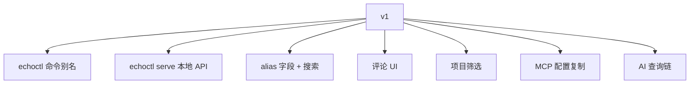

| 顺序 | 项目 | 原因 |
|------|------|------|
| 1 | `echoctl` 命令别名 | 改名越早成本越低 |
| 2 | `echoctl serve` 本地 API | 拱心石。解锁评论写入、capture 开关、MCP 配置、项目列表 |
| 3 | alias 数据模型 + 搜索 | 解决当前命令式标题不可读，移除临时 `article-aliases.json` |
| 4 | 评论 UI | 文内选区 + 底部输入框。锚点模型已足够（正文不可变） |
| 5 | 项目筛选 | 关系到信息架构，需 `project` frontmatter 字段 |
| 6 | MCP 配置复制 | 实用但不影响核心数据流 |
| 7 | AI 查询链 v1 | 全局最近查询日志；v2 按文章关联 |

## 已确认

- `alias` 字段为单个字符串（非数组）。显示规则：alias > title > id。
- 评论作者身份从 `echo.json` 配置文件读取，所有评论统一使用同一作者名。
- 本地 API 服务与 VitePress preview 合并为 `echoctl serve`，一个命令同时启动 API 和文档服务。
- 查询链先做全局日志（"最近 Claude 搜索了 X，找到 3 篇文章"），后续再做按文章关联。
- 项目元数据在 convert 时根据 registry 补齐，不在 hook 捕获时写入。

## 任务分解

按实施顺序排列。每个任务标注影响文件数和预估复杂度（S/M/L）。

### T1. CLI 改名 echoctl（第 6 节）

| # | 任务 | 文件 | 复杂度 |
|---|------|------|--------|
| T1.1 | 新建 `scripts/lib/cli/names.js` — canonical + legacy 命名模块 | 1 新 | S |
| T1.2 | `git mv bin/echo-mcp.js bin/echoctl.js`；usage/error 改用 `commandFor()` | 1 | S |
| T1.3 | `package.json` bin 双入口 + script 更新 | 1 | S |
| T1.4 | `install-claude-hook.js` — DESIRED_HOOKS 改 echoctl；检测用 `isKnownCliCommand` | 1 | M |
| T1.5 | `run-doctor.js` — 修复提示改 echoctl；hook 检测兼容两者 | 1 | M |
| T1.6 | `status.js` — captureHint 走 `commandFor()` | 1 | S |
| T1.7 | `mcp/server.js` — SERVER_INFO 从 names.js 导入，值不变 | 1 | S |
| T1.8 | 测试更新 + 新增 `test/cli-names.test.js` | 3 | M |
| T1.9 | 文档批量更新（README/USAGE/ECHO_STATUS/ENGINEERING_BOUNDARIES） | 4 | S |
| T1.10 | `npm link` 验证 + `echoctl` / `echo-mcp` 双命令冒烟测试 | 0 | S |

### T2. alias frontmatter 字段（第 1 节）

| # | 任务 | 文件 | 复杂度 |
|---|------|------|--------|
| T2.1 | `echo-format.js` — `createArticle()` 接收 alias；`toMarkdown()` 序列化 | 1 | S |
| T2.2 | `convert-buffer.js` + `import-sessions.js` — convert/import 写 alias | 2 | S |
| T2.3 | `build-docs.js` — 删除 `loadArticleAliases`；`displayTitle()` 读 frontmatter | 1 | S |
| T2.4 | `search.js` + `query-articles.js` — keyword 搜索覆盖 alias | 2 | S |
| T2.5 | 存量 migration — `article-aliases.json` 数据写回对应文章 frontmatter；删除 JSON | 1 | S |
| T2.6 | 测试更新 — echo-format、search 断言语义变化 | 2 | S |
| T2.7 | `npm run all` 验证 — convert 后新文章有 alias；旧文章无 alias 回退到 title | 0 | S |

### T3. project 元数据（第 8 节）

| # | 任务 | 文件 | 复杂度 |
|---|------|------|--------|
| T3.1 | `echo-paths.js` — `resolveDataDirs()` 返回 `projectId` + `projectRoot` | 1 | S |
| T3.2 | `echo-format.js` — 支持 `project` string frontmatter 字段 | 1 | S |
| T3.3 | `convert-buffer.js` + `import-sessions.js` — 写入 project | 2 | S |
| T3.4 | `project-registry.js` — 新增 `listProjects(echoHome)` 函数 | 1 | S |
| T3.5 | `build-docs.js` — 聚合所有项目；生成 filter UI（前端 JS 按 data-project 筛选） | 1 | M |
| T3.6 | `query-articles.js` — `searchArticles()` 支持 `project` 参数 | 1 | S |
| T3.7 | `tools.js` — `search_articles` schema 加 `project` 参数 | 1 | S |
| T3.8 | 测试更新 | 2 | S |

### T4. write-comment usecase（第 4、5 节）

| # | 任务 | 文件 | 复杂度 |
|---|------|------|--------|
| T4.1 | 新建 `scripts/lib/usecases/write-comment.js` — 核心逻辑：验证 article、解析 anchor（复用 anchor.js）、计算 ann ID、写文件 | 1 新 | M |
| T4.2 | `annotate.js` — CLI 改为调用 `writeComment()` | 1 | S |
| T4.3 | `validation.js` — 支持 `anchor.kind === "article"`（不要求 quote/prefix/suffix/occurrence/line_hint） | 1 | S |
| T4.4 | `build-docs.js` — 渲染 article-level comment 时不显示 quote block | 1 | S |
| T4.5 | 测试 — `test/write-comment.test.js` | 1 新 | M |

### T5. echoctl serve（第 7 节，串联 T2-T4）

| # | 任务 | 文件 | 复杂度 |
|---|------|------|--------|
| T5.1 | 新建 `scripts/serve.js` — HTTP server（Node http）+ VitePress child process；port 自动协商；SIGTERM 清理 | 1 新 | L |
| T5.2 | `serve.js` — `GET/POST /api/capture`（调用 config.js） | 同上 | S |
| T5.3 | `serve.js` — `POST /api/comments`（调用 write-comment + rebuild docs） | 同上 | M |
| T5.4 | `serve.js` — `GET /api/projects`（调用 project-registry） | 同上 | S |
| T5.5 | `serve.js` — `GET /api/mcp-config`（调用 names.js） | 同上 | S |
| T5.6 | `serve.js` — `GET /api/query-log`（调用 query-log） | 同上 | S |
| T5.7 | `bin/echoctl.js` — 新增 `serve` 子命令 | 1 | S |
| T5.8 | `package.json` — 新增 `"serve"` 脚本 | 1 | S |
| T5.9 | 冒烟测试 — `echoctl serve` 启动，API + VitePress 都可访问 | 0 | S |

### T6. MCP query log（第 3 节）

| # | 任务 | 文件 | 复杂度 |
|---|------|------|--------|
| T6.1 | 新建 `scripts/lib/infra/query-log.js` — `appendQueryLog()` + `readRecentQueryLog()` | 1 新 | S |
| T6.2 | `mcp/server.js` — `tools/call` 包计时 + 写 log | 1 | S |
| T6.3 | 前端渲染 — 从 `/api/query-log` 读取渲染"最近查询"（T5 已覆盖 endpoint） | 1 | S |

### T7. 前端 UI（第 2、4、5、8 节）

| # | 任务 | 文件 | 复杂度 |
|---|------|------|--------|
| T7.1 | MCP 配置按钮 + 复制 modal | 生成脚本或 theme | S |
| T7.2 | 文内选区评论 — 选中文字 → 弹出输入框 → POST → 刷新 | 生成脚本或 theme | M |
| T7.3 | 底部评论输入框 — 文本域 + 提交按钮 | 生成脚本或 theme | S |
| T7.4 | Capture 开关 UI — toggle 组件，调 `/api/capture` | 生成脚本或 theme | S |
| T7.5 | 项目筛选 — filter bar（All \| project1 \| project2） | 生成脚本或 theme | S |
| T7.6 | 最近 MCP 查询展示区域 | 生成脚本或 theme | S |

### T8. 测试覆盖

| # | 任务 | 文件 | 复杂度 |
|---|------|------|--------|
| T8.1 | `test/cli-names.test.js` — 新模块单元测试 | 1 新 | S |
| T8.2 | `test/write-comment.test.js` — 新 usecase 单元测试 | 1 新 | M |
| T8.3 | 已有测试回归更新（install-hook、run-doctor、mcp-server） | 3 | M |
| T8.4 | `echoctl serve` 集成测试 — 启动 → API 调用 → 关闭 | 1 新 | M |
| T8.5 | `npm run all` 全管线通过 | 0 | S |

### 实施依赖图

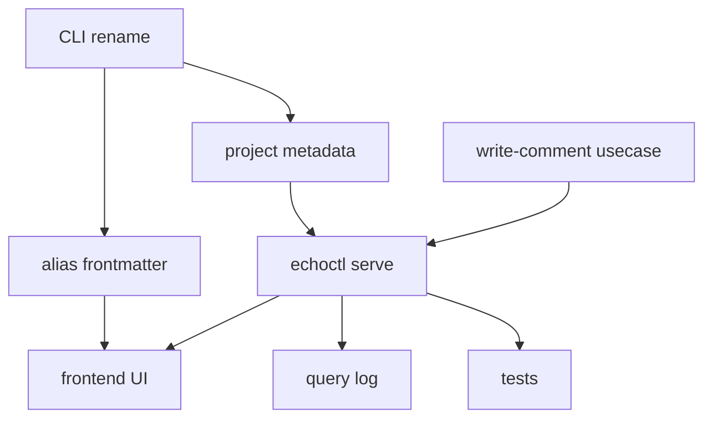

**关键路径：** T1 → T4 → T5 → T7。T1 是改名（越早成本越低），T4 是评论写入基础设施，T5 是拱心石（串联其他功能），T7 是用户可见层。
