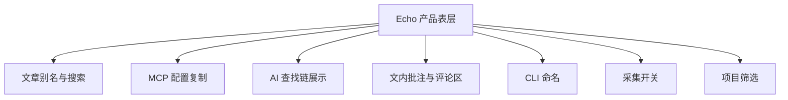
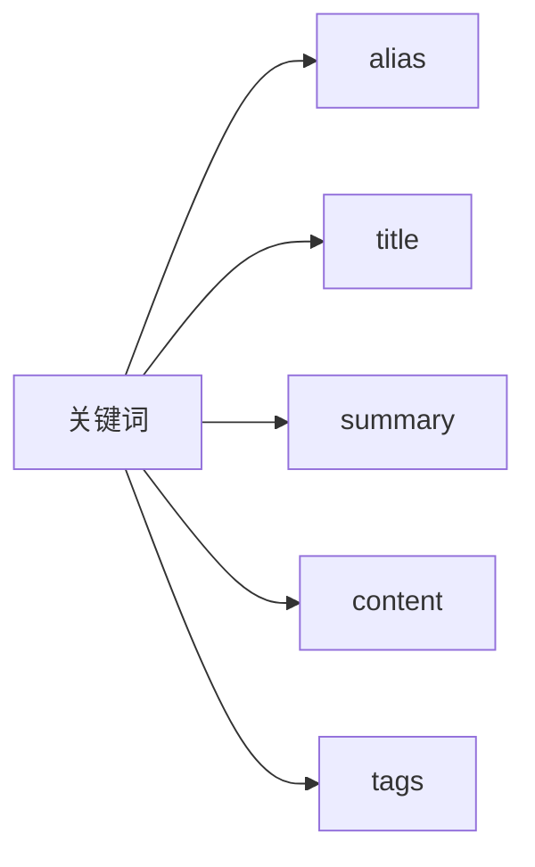
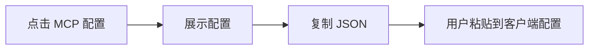
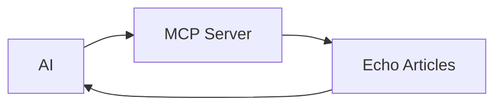
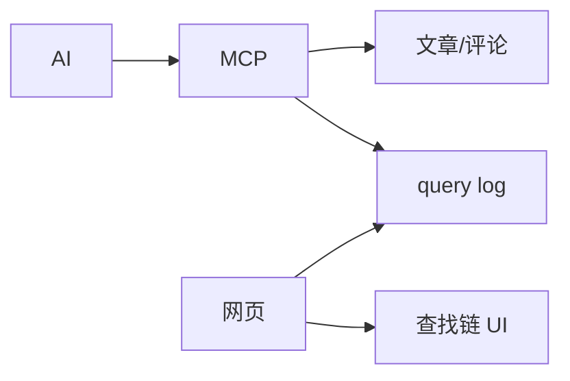
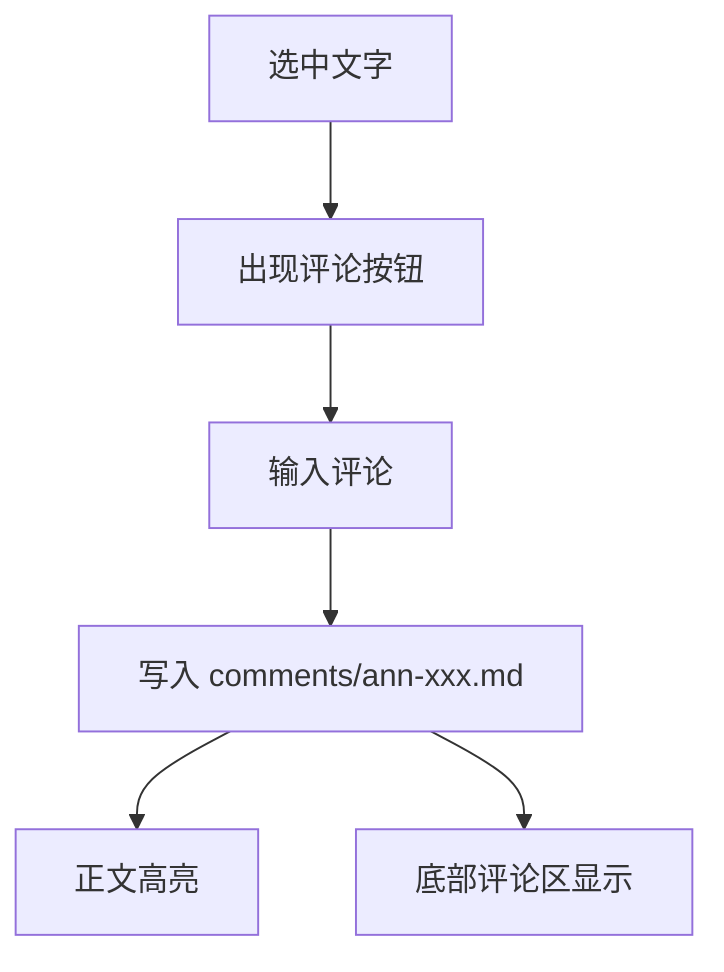
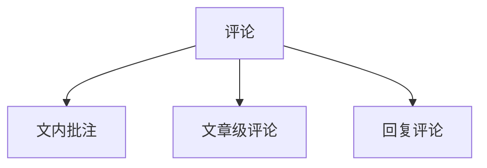
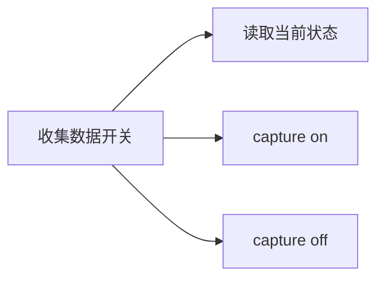
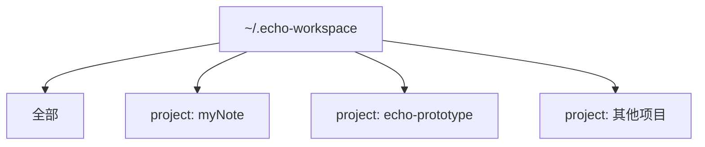
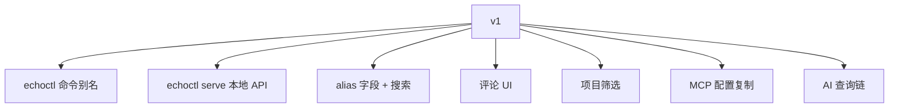

# 005 - Echo 产品界面与交互设计备忘

## 背景

这份文档记录 2026-05-24 的一轮产品讨论。原则是：先讨论清楚，再落文档，最后再改代码。

当前 Echo 已经具备：

```text
hook 捕获 -> buffer -> articles/comments -> VitePress 展示 -> MCP 只读查询
```

下一阶段问题集中在产品表层：用户如何命名、搜索、安装 MCP、控制采集、按项目浏览，以及如何在文章里留下批注。

## 总览



## 1. 文章别名进入数据模型

当前临时方案是 `article-aliases.json`，只影响 VitePress 展示。长期更合理的方案是把别名纳入文章 frontmatter。

建议字段：

```yaml
id: session-2026-05-22
title: "/understand-anything:understand --language zh"
alias: "幂等是什么：一次和两次为什么一样"
summary: "..."
```

显示规则：

| 场景 | 字段优先级 |
|------|------------|
| 页面 H1 | `alias` -> `title` -> `id` |
| 侧边栏 | `alias` -> `title` -> `id` |
| 首页/文章列表 | `alias` -> `title` -> `id` |
| 原始会话来源 | 保留 `title` 或正文首轮命令 |

搜索规则：



关键决定：

- `alias` 是人类可读标题，不替代原始命令。
- `title` 保留原始来源，尤其是命令式会话标题。
- MCP 和网页搜索都应该查 alias，避免只有展示层知道别名。

## 2. 页面增加 MCP 配置按钮

用户希望网页上有一个“配置 MCP”按钮，点击后复制配置，由用户自行安装。

目标体验：



示例配置：

```json
{
  "mcpServers": {
    "echo": {
      "command": "echoctl",
      "args": ["mcp"]
    }
  }
}
```

需要说明：

| 前提 | 说明 |
|------|------|
| CLI 已安装 | 用户机器上必须能运行 `echoctl` |
| 不自动写配置 | 网页只复制配置，不替用户改 Claude/Codex 配置 |
| 兼容旧命令 | 迁移期可继续给出 `echo-mcp` 版本 |

## 3. AI 通过 MCP 查询时，网页展示查找链

当前 MCP 数据流：



网页不知道 AI 查了哪些文章。若要显示查找链，需要 MCP 写查询日志：



日志草案：

```json
{
  "time": "2026-05-24T00:00:00Z",
  "client": "claude",
  "tool": "search_articles",
  "query": "幂等",
  "results": ["session-2026-05-22"]
}
```

开放问题：

| 问题 | 说明 |
|------|------|
| 当前页面如何关联一次 MCP 查询 | 可以按结果包含当前 article id 来关联 |
| 是否需要会话 ID | 精准关联需要 AI/MCP 带 session/page id，复杂度更高 |
| 是否实时 | 可先轮询 query log，后续再考虑 SSE/WebSocket |

建议阶段：

| 阶段 | 范围 |
|------|------|
| v1 | 全局最近 MCP 查询日志 |
| v2 | 当前文章相关查询链 |
| v3 | 按 AI 会话精确关联当前页面 |

## 4. 文内选区评论

目标：用户选中一段文字后，出现气泡或浮层，输入评论；保存后正文对应片段出现高亮/标识，底部评论区同步显示。

交互：



评论锚点建议继续沿用现有模型：

```yaml
target:
  article_id: session-2026-05-22
anchor:
  quote: "幂等只保证一件事"
  prefix: "..."
  suffix: "..."
  occurrence: 1
author: vincent
```

视觉建议：

| 位置 | 表现 |
|------|------|
| 被批注文字 | 淡色背景 |
| 段落旁边 | 小编号或评论标记 |
| 点击标记 | 展开对应评论 |
| 底部评论区 | 显示同一条评论卡片 |

关键点：

- 文章正文不可变（immutable）。文章是 AI 对话转写，等同于已发表内容。即使是作者本人，也不在网页端修改正文。
- 文内评论只写 `comments/`，不改文章正文。
- 锚点只需处理重复文本消歧义，不需要处理正文变动后的漂移（正文不变，锚点永远有效）。
- 前端展示层面的 Markdown 渲染差异不影响锚点解析（`stripInlineFormatting` 已处理 `**bold**` 等格式标记）。

## 5. 底部评论区输入框

底部评论区需要支持直接输入评论。它与文内批注不同，是文章级评论。

评论类型建议：



| 类型 | 是否有 quote | 显示位置 |
|------|--------------|----------|
| 文内批注 | 有 | 正文高亮 + 评论区 |
| 文章级评论 | 无 | 底部评论区 |
| 回复评论 | 可无 quote | 评论卡片下方 |

后续想法可以在这里继续扩展，例如评论回复链、评论转文章、评论进入进化链。

## 6. CLI 命名：从 `echo-mcp` 迁移到 `echoctl`

`echo` 是 Unix/macOS/Linux 的系统级命令，不适合占用。

讨论过的候选：

| 命令 | 评价 |
|------|------|
| `echo` | 冲突太大，不用 |
| `echo-mcp` | 太窄，只像 MCP 子工具 |
| `echocli` | 直白但普通 |
| `echokb` | 知识库感明确 |
| `echoctl` | 工程感强，稳定 |

随机决策结果：

```text
roll = 4
0-10 => echoctl
11-20 => echokb
```

暂定：

```bash
echoctl init
echoctl capture on
echoctl mcp
echoctl serve
```

迁移策略：

| 阶段 | 策略 |
|------|------|
| v1 | 新增 `echoctl` bin，保留 `echo-mcp` |
| v2 | 文档主推 `echoctl` |
| v3 | `echo-mcp` 作为兼容别名或提示迁移 |

## 7. 页面增加“收集数据”开/关

网页需要能控制当前的 capture 状态，对应 CLI：

```bash
echoctl capture status
echoctl capture on
echoctl capture off
```

目标 UI：



限制：

静态 VitePress 页面不能直接执行本地命令。因此需要本地 API 服务。

建议引入：

```bash
echoctl serve
```

职责：

| 能力 | 说明 |
|------|------|
| 读取 capture 状态 | 返回 `capture_enabled` |
| 切换 capture | 写入 `echo.json` |
| 评论写入 | 支持文内批注和文章级评论 |
| MCP 配置 | 返回可复制配置 |
| 项目列表 | 返回全部项目和当前项目 |

## 8. 按项目显示对话，保留“全部”

目标：统一归档所有项目，但网页可以按项目筛选。

推荐模型：



关键决定：

| 维度 | 选择 |
|------|------|
| 物理存储 | 统一存储在 Echo home |
| 逻辑显示 | 按 project 元数据筛选 |
| 页面入口 | `全部` + 各项目 |
| 搜索 | 支持全局搜索和项目内搜索 |

文章 frontmatter 建议增加：

```yaml
project:
  id: mynote
  name: myNote
  path: /Users/vincenthuang/myNote
```

页面筛选：

```text
项目：全部 | myNote | echo-prototype | ...
```

## 跨模型审查结论 (2026-05-24)

第二意见（Claude 子代理独立审查）提出了几个关键发现：

### 锚点漂移风险（已消除）

~~quote + prefix/suffix + occurrence 模型在文章被编辑后会静默失效。~~ **2026-05-24 澄清**：文章正文不可变。Echo 文章是 AI 对话转写，等同于已发表内容——即使作者本人也不修改正文。这与 Hypothesis 锚定活网页的场景完全不同。锚点永远锚定不变的文本，不存在漂移问题。此风险归零，spike 取消。

### `echoctl serve` 是拱心石

本地 API 服务同时解锁了评论写入、capture 开关、MCP 配置端点、项目列表——没有它，8 个特性中的 4 个都只能依赖页面刷新。应该在评论 UI 之前先建好它。

### Hypothesis 值得学习，不值得引入

Hypothesis 的锚点思路和 Echo 几乎一致，但其实现是浏览器扩展级别的重量方案。Echo 应保持轻量：扁平 Markdown 文件 + Node stdlib，只借鉴其锚点策略的思想，不引入外部依赖。

## v1 范围与建议实施顺序



| 顺序 | 项目 | 原因 |
|------|------|------|
| 1 | `echoctl` 命令别名 | 改名越早成本越低 |
| 2 | `echoctl serve` 本地 API | 拱心石。解锁评论写入、capture 开关、MCP 配置、项目列表 |
| 3 | alias 数据模型 + 搜索 | 解决当前命令式标题不可读，移除临时 `article-aliases.json` |
| 4 | 评论 UI | 文内选区 + 底部输入框。锚点模型已足够（正文不可变） |
| 5 | 项目筛选 | 关系到信息架构，需 `project` frontmatter 字段 |
| 6 | MCP 配置复制 | 实用但不影响核心数据流 |
| 7 | AI 查询链 v1 | 全局最近查询日志；v2 按文章关联 |

## 已确认

- `alias` 字段为单个字符串（非数组）。显示规则：alias > title > id。
- 评论作者身份从 `echo.json` 配置文件读取，所有评论统一使用同一作者名。
- 本地 API 服务与 VitePress preview 合并为 `echoctl serve`，一个命令同时启动 API 和文档服务。
- 查询链先做全局日志（"最近 Claude 搜索了 X，找到 3 篇文章"），后续再做按文章关联。
- 项目元数据在 convert 时根据 registry 补齐，不在 hook 捕获时写入。
