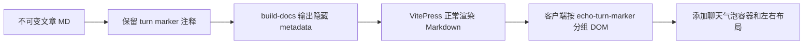
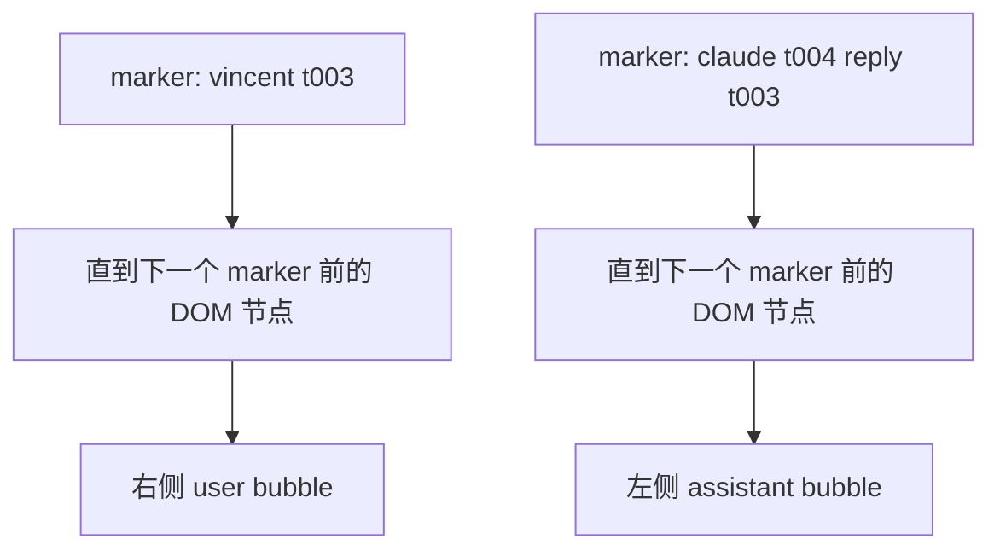
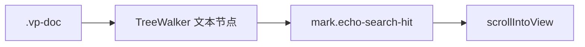
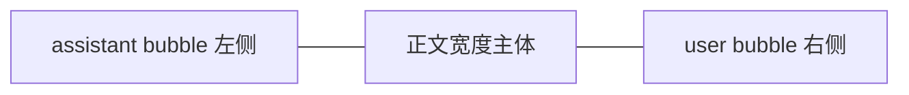

# 010 — 文章正文聊天气泡化

日期：2026-05-26

## 背景

当前文章页把对话正文渲染成普通 Markdown 流，用户发言会显示成类似：

```text
我：很好，这些事情你自己使用多agents处理
```

这更像日志导出，不像对话归档。Echo 的核心对象是 AI 对话，阅读体验应该更接近聊天软件：用户发言靠右、AI 回复靠左，并且有清晰的轮次边界。

## 目标

- 文章正文以聊天气泡形式展示。
- 用户发言靠右，AI/Claude 发言靠左。
- 原始文章 Markdown 不修改，仍保持不可变。
- turn marker 继续作为隐藏 metadata 发挥作用。
- 不影响 search landing：搜索命中仍能高亮并滚动到正确位置。
- 不影响 annotation anchor：锚点仍基于正文文本解析。

## 非目标

- 不改文章正文格式。
- 不把 Echo 改成聊天编辑器。
- 不在 validate/index 阶段重写正文。
- 不为了视觉效果牺牲代码块、表格、列表等 Markdown 渲染。

## 推荐方案

在 VitePress 主题层做“渲染后分组”，不要在 Markdown 源文本里硬插大块 HTML 容器。



理由：

| 方案 | 结论 | 原因 |
|---|---|---|
| 直接用 CSS 匹配 `我：...` | 不推荐 | 只能处理单段文本，AI 回复中的表格/代码块无法完整包住 |
| `build-docs.js` 输出包裹 Markdown 的 HTML | 谨慎 | Markdown 进入 HTML block 后解析行为容易变复杂 |
| VitePress 渲染后按 turn marker 分组 | 推荐 | 保留 Markdown 渲染结果，再做视觉布局，风险最低 |

## 分组规则

当前 `build-docs.js` 已将 turn marker 输出为隐藏节点：

```html
<span
  class="echo-turn-marker"
  hidden
  aria-hidden="true"
  data-turn-id="t004"
  data-speaker="claude"
  data-reply-to="t003"
></span>
```

可以用它作为轮次边界：



建议 speaker 映射：

| speaker | bubble 类型 |
|---|---|
| `vincent` / `user` / `我` | user，靠右 |
| `ai` / `claude` / `assistant` | assistant，靠左 |
| 其他 | unknown，靠左弱化 |

## Search 约束

当前 search landing 逻辑在 `.vp-doc` 下遍历文本节点：



实现时必须保证：

- 气泡正文仍位于 `.vp-doc` 内。
- 不把正文放入 `nav`、`button`、`pre`、`code`、`.echo-toolbar`、`.echo-modal`、`.echo-comment-box` 等 search skip 区域。
- 包装 DOM 时保留原始文本节点顺序。
- `mark.echo-search-hit` 可以被插入到气泡内部。
- 搜索滚动目标如果在气泡内，`scrollIntoView` 仍能把整段气泡附近滚到视口中央。

## Annotation 约束

annotation 的 anchor 解析发生在源文章文本层，聊天气泡只是展示层，因此原则上不影响锚点解析。

实现时仍需注意：

- 不修改 `docs/articles/generated/*.md` 中的正文文本内容。
- 不改变 `highlightAnnotations()` 对 quote 的替换语义。
- 如果高亮命中在气泡内部，`mark.echo-highlight` 样式需要和气泡背景对比清晰。

## UI 建议



建议样式：

| 类型 | 样式 |
|---|---|
| user | 靠右，最大宽度 72%，轻品牌色背景，圆角较小 |
| assistant | 靠左，最大宽度 92%，适合表格/代码块，背景接近正文卡片 |
| long table/code | assistant 气泡允许横向滚动，不压缩代码 |
| mobile | 两侧都接近全宽，但仍用左右轻微缩进区分 |

避免：

- 大圆角和强装饰，Echo 仍是知识库，不是社交 IM。
- 把整篇文章变成卡片套卡片。
- 让表格、代码块溢出正文区域。

## 实施步骤

1. 新增 `EchoChatBubbles.vue` 或主题增强脚本，在文章页 mounted 后运行。
2. 扫描 `.vp-doc` 里的 `.echo-turn-marker`。
3. 以 marker 为边界收集后续 sibling 节点，直到下一个 marker 或评论区/交互区。
4. 创建 `.echo-chat-turn` 容器，按 speaker 加 `.echo-chat-user` / `.echo-chat-assistant`。
5. 将该轮次节点移动进容器，不复制文本。
6. 添加 CSS：左右布局、气泡背景、表格/代码块溢出处理、移动端适配。
7. 验证 search landing 和 annotation highlight。

## 验收标准

- `我：...` 这类用户发言显示为右侧气泡。
- `ai 的回复` 及其后续表格/代码块显示在左侧气泡中。
- 页面源码/DOM 中仍存在 hidden `echo-turn-marker` metadata。
- 从搜索结果进入文章后，命中词仍高亮并滚动到正确位置。
- inline annotation 高亮仍可见且位置正确。
- 不修改原始文章正文。

## 风险

| 风险 | 缓解 |
|---|---|
| DOM 分组误包评论区 | 遇到 `h2#评论区`、`.echo-comment-list`、`.echo-comment-box` 停止 |
| VitePress hydration 之后 DOM 被二次改写 | 在 mounted + route change 后执行，并加 `data-echo-chatified` 幂等标记 |
| 搜索高亮与气泡脚本执行顺序冲突 | 气泡脚本只移动节点，不重建文本；必要时在 search schedule 前完成 |
| 长表格撑破布局 | 气泡内表格/代码块设置 `overflow-x: auto` |

## 状态

已完成 (2026-05-26)。
