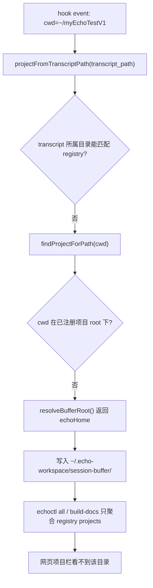

# Issue 012 — 多项目网页端不可见：resolveDataDirs 只解析当前项目

日期：2026-05-26
状态：已实现；2026-05-27 追加未注册目录复盘

## 现象

用户在 `~/myHomeworkHelper` 执行了完整流程：

```
echo init → 开启 capture → Claude 聊天
```

项目已注册到 `registry.json`，data 目录已创建，但网页端完全看不到 `myHomeworkHelper` 项目及其文章。

## 根因

`resolveDataDirs()` → `findProjectForPath(cwd)` **只解析当前工作目录匹配的单个项目**。

调用链：
```
build-docs.js
  → resolveDataDirs({ cwd })           # 只找当前 cwd 匹配的 1 个项目
    → findProjectForPath(cwd)          # 扫描 registry，找最长前缀匹配
      → 返回 mynote（因为 cwd 是 ~/myNote）
```

`build-docs.js` 的 `renderArticleIndex()` 虽然有 `collectProjects()` 和项目筛选 UI 代码，但它只能对**单个项目已加载的文章**做分组——文章来源只有 `resolveDataDirs()` 返回的那 1 个项目。

**结论：缺少跨项目文章聚合层。** `build-docs.js` 需要扫描所有已注册项目的数据目录，而非仅当前项目。

## 影响范围

### 需要新增

- **`lib/usecases/`** — 新增 `aggregate-all-projects.js`：
  - 调用 `listProjects()` 获取所有已注册项目
  - 遍历每个项目的 `articles/` 目录
  - 给每篇文章加上 `_project` 标记
  - 返回全部文章的扁平列表 + 所有评论列表

### 需要修改

- **`build-docs.js`** — 将 `resolveDataDirs()` 替换为多项目聚合：
  - 文章加载：从单项目 → 全项目
  - 评论加载：从单项目 → 全项目
  - `renderArticleIndex()`：已有项目筛选 UI 骨架，接入多项目数据即可

### 不需要改

- **管线脚本**（convert/validate/import/search/annotate）— 它们使用 `resolveDataDirs()` 的单项目行为是正确的，不改动

## 验收标准

- [x] 在 `~/myNote` 运行 `npm run all`，网页端能看到所有已注册项目的文章
- [x] 项目筛选导航正确显示各项目及其文章数
- [x] `npm run all` 通过
- [x] 管线脚本（convert/validate/import）不受影响

## 2026-05-27 追加复盘：未注册目录仍会在网页项目栏不可见

### 现场现象

用户在 `~/myEchoTestV1` 里产生了新的 AI 对话，并验证了 `AskUserQuestion` 弹框选项捕获。但打开网页 `/articles/` 时，左侧“项目”分组只有：

```text
myhomeworkhelper
mynote
```

没有出现 `myEchoTestV1`。

### 直接原因

`~/myEchoTestV1` 当时**没有注册到 `~/.echo-workspace/registry.json`**。

hook 捕获逻辑只会把“已注册项目”的会话写入：

```text
~/.echo-workspace/projects/<project-id>/session-buffer/
```

未注册目录会触发 legacy fallback，写入：

```text
~/.echo-workspace/session-buffer/
```

这次实际落点是：

```text
~/.echo-workspace/session-buffer/session-2026-05-27-v13.md
```

### 调用链解释



关键代码语义：

```js
// scripts/lib/hooks/capture.js
return { bufferRoot: echoHome, project: null };
```

这说明之前完成的“项目路由”并不是“任意新目录自动变成 project”，而是：

| 目录状态 | 捕获落点 | 网页项目栏 |
|---|---|---|
| 已注册项目 | `projects/<project-id>/session-buffer/` | 可见 |
| 未注册目录 | 顶层 `session-buffer/` legacy fallback | 不可见，除非后续显式迁移/注册 |

### 为什么 Issue 012 的修复没有覆盖它

Issue 012 修复的是：

> 已注册项目的数据已经在 `projects/<id>/articles/` 中，但 `build-docs.js` 只读取当前 cwd 项目，导致其他已注册项目不可见。

本次现象是另一类：

> 目录未注册，所以它根本没有进入 `projects/<id>/` 数据模型；网页聚合层自然不会扫描它。

### 当前兜底处理记录

已将 `~/myEchoTestV1` 注册为：

```text
projectId: myechotestv1
root:      /Users/vincenthuang/myEchoTestV1
dataRoot:  ~/.echo-workspace/projects/myechotestv1
```

并将 legacy buffer：

```text
~/.echo-workspace/session-buffer/session-2026-05-27-v13.md
```

复制到：

```text
~/.echo-workspace/projects/myechotestv1/session-buffer/session-2026-05-27-v1.md
```

补充：

```text
session-map.txt
auq-counter.txt
```

随后 `echoctl all` 生成 1 篇文章，`docs:generate` 后浏览器验证：

```text
/articles/ 显示 myechotestv1 (1)
总文章数 27
```

### 后续产品决策

当前行为是“兼容型 fallback”，但用户感知上容易误解为捕获丢失。建议后续不要静默落 legacy，至少做一个显式提示或可见 inbox。

候选方案：

| 方案 | 行为 | 风险 |
|---|---|---|
| 保持现状 | 未注册目录继续写顶层 legacy buffer | 用户看不到，容易以为失败 |
| SessionStart 提示 | 未注册 cwd 时提示 `echoctl init project` | 最小改动，仍保留 fallback |
| `__inbox__` 项目 | 未注册目录写入可见的 inbox 项目 | 页面可见，但 project 语义变弱 |
| 自动注册 | hook 发现未知 cwd 自动创建项目 | 可能把临时目录/系统目录污染进 registry |

当前倾向：**先做 SessionStart/doctor 明确提示，避免静默不可见；不要立即自动注册。**
