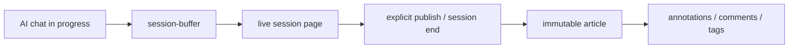

# Issue 016 — Live session vs immutable article

## 背景

Echo 的核心原则是：文章正文一旦发布就不可变。文章是 AI 对话的源记录，不应该被 validator、importer、MCP 工具或页面交互悄悄改写。

现在出现一个产品状态缺口：用户仍然处在 AI 聊天会话中，但页面已经生成了。继续输入新内容后，页面不会继续更新。直觉上用户希望“正在聊天的页面”能实时追加；但如果我们反复覆盖正式文章，又会破坏不可变原则。

## 决策方向

把“正在记录的会话”和“已发布文章”拆成两个状态：

## 语义边界

| 层 | 是否可变 | 说明 |
|---|---:|---|
| `session-buffer` | 是 | hook 持续追加 turn，是进行中的原始会话缓冲 |
| live session page | 是 | 从 buffer 渲染，可随聊天刷新，不是正式文章 |
| published article | 否 | 发布后的正文不可再改 |
| comments/tags/annotations | 是 | 后续解读层，允许新增和调整 |

## 禁止方案

- 不要让 `convert` 在同一篇正式 article 上反复覆盖正文。
- 不要把“页面已经生成”误当成“文章已经发布并冻结”。
- 不要要求用户手动 `Ctrl+C` 重启 `serve` 才能看到新内容。

## 推荐实现

1. 新增 live session 数据源：直接读取 `projects/<project-id>/session-buffer/*.md`。
2. VitePress 生成一个 live sessions 视图，展示仍在增长的 buffer。
3. `serve` 自动 refresh 时同步更新 live session page。
4. 会话结束或用户显式发布时，才把 buffer snapshot 转为正式 article。
5. 正式 article 生成后保持不可变；后续补充走 annotation/comment/tag。

## 待确认

- “会话结束”的判定用 Claude hook 的 SessionEnd，还是先提供手动 publish 命令？
- live session URL 是否复用文章详情布局，还是单独 `/live/<project>/<session>`？
- 正式发布后，live page 是重定向到 article，还是保留为历史调试入口？

