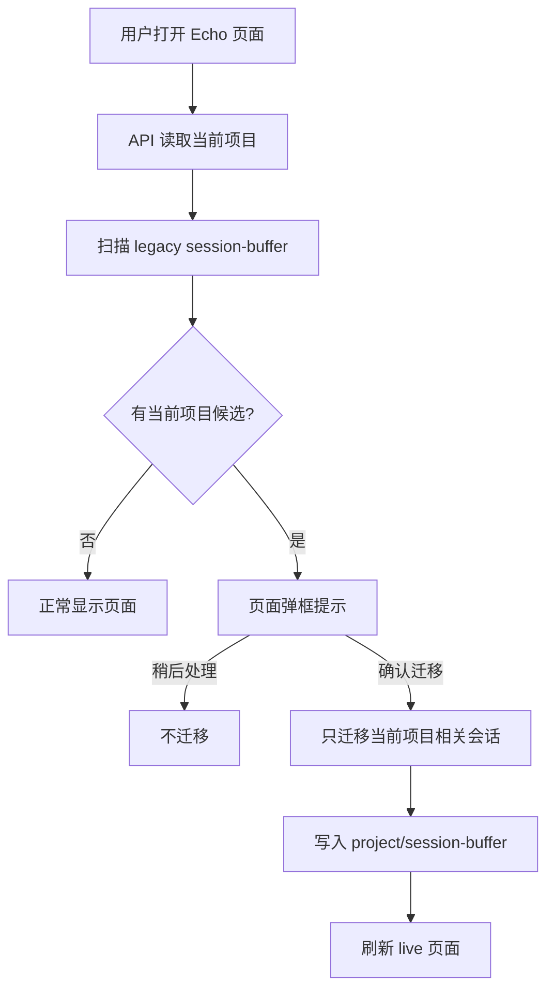
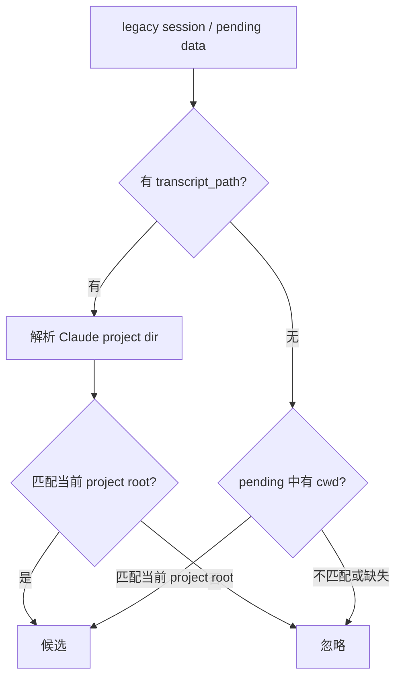
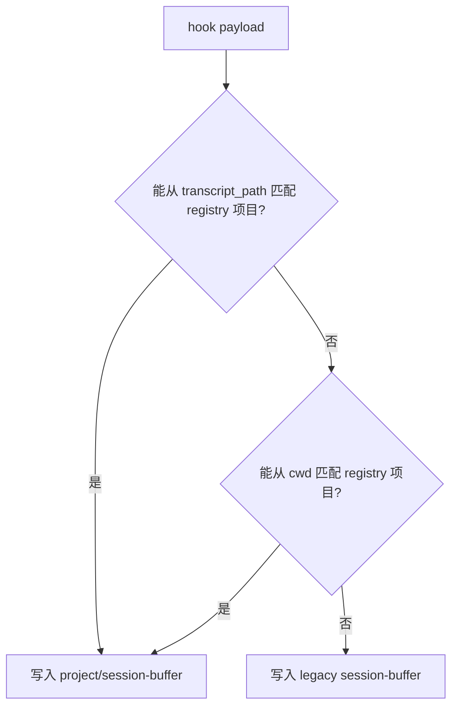

# Issue 017 — Capture 生命周期与 legacy 恢复

## 背景

Echo 现在有三类容易混淆的状态：

1. 用户已经启动 `echoctl serve`，但还没有为当前工程运行 `echoctl init project`。
2. Hook 已经开启自动收集，当前工程的会话被写入 Echo home 顶层 legacy `session-buffer`。
3. 用户后来注册项目，希望页面能把属于当前项目的旧会话补回来。

早期人工处理方式是：手动把 legacy 里的 `.md` 会话 buffer 复制到 `projects/<project-id>/session-buffer/`，再补 `session-map.txt` 和刷新页面。这个方式不可持续，也不符合产品语义。

新的产品原则是：

> Echo 可以帮用户恢复误入 legacy 的会话，但必须只迁移当前项目相关的会话，并且必须经过用户确认。

## 目标

- 不再让用户依赖手工复制 legacy buffer。
- 不把 legacy 中所有会话一股脑迁移到某个项目。
- 页面中发现当前项目相关 legacy 候选时，弹框提示用户确认。
- 用户确认后，只迁移当前项目相关会话。
- 从此以后，能够识别为当前项目的 session buffer 只能写入 `projects/<project-id>/session-buffer/`，不能继续写入 legacy。

## 非目标

- 不自动发布 legacy 会话为 article。
- 不自动删除 legacy 原始文件，除非后续另有显式清理流程。
- 不在迁移阶段修改会话正文。
- 不把不可识别项目归属的 legacy 会话强行归入当前项目。

## 总体流程



## 当前项目候选判定

迁移候选必须能证明和当前项目有关。建议按以下优先级判断：



### 可用信号

| 信号 | 来源 | 可信度 | 说明 |
|---|---|---:|---|
| `transcript_path` | hook payload / pending JSON | 高 | Claude project 目录通常能反推真实工程路径 |
| `cwd` | hook payload / pending JSON | 高 | 如果 cwd 在当前项目 root 下，可直接匹配 |
| `session-map.txt` | legacy buffer root | 中 | 只能证明 session id 与 buffer 文件关系，不证明项目归属 |
| buffer 文件名日期 | `.md` 文件名 | 低 | 不能用于项目归属判断 |
| 用户当前打开页面 | web state | 低 | 只能确定目标项目，不能证明 source 属于它 |

候选列表中不得包含“只有日期相近”或“没有归属证据”的会话。

## 页面交互

### 弹框触发条件

当满足以下条件时，页面显示 legacy 恢复弹框：

- `echoctl serve` 正在运行。
- 当前页面能确定 current project。
- API 发现 legacy buffer 中存在当前项目候选。
- 用户本轮 session 没有选择“稍后处理”。

### 弹框文案

建议文案：

```text
Echo 发现有一些会话记录之前进入了 legacy 区。
它们看起来属于当前项目。

是否迁移到当前项目？
迁移后，它们会出现在当前项目的实时会话或文章列表中。
```

英文：

```text
Echo found chat records in the legacy area.
They appear to belong to the current project.

Move them into this project?
After migration, they will appear in this project's live sessions or articles.
```

### 按钮

| 按钮 | 行为 |
|---|---|
| 稍后处理 / Later | 关闭弹框，本次页面会话不再提示 |
| 查看候选 / Review | 展开候选 session 列表 |
| 迁移到当前项目 / Move to this project | 执行迁移 |

### 候选展示字段

| 字段 | 说明 |
|---|---|
| session id | 如果能从 map 或 pending 中取得 |
| buffer 文件 | legacy `.md` 文件名 |
| turn count | 粗略统计 `<!-- turn:` 数量 |
| last modified | 文件修改时间 |
| confidence | `transcript_path` / `cwd` / mixed |
| evidence | 匹配到的 project root 或 transcript project dir |

## API 草案

### GET `/api/legacy-candidates?projectId=<id>`

返回当前项目相关 legacy 候选。

```json
{
  "projectId": "myechotestv2",
  "sourceDir": "/Users/me/.echo-workspace/session-buffer",
  "candidates": [
    {
      "sessionId": "abc",
      "fileName": "session-2026-05-28-v1.md",
      "sourcePath": "/Users/me/.echo-workspace/session-buffer/session-2026-05-28-v1.md",
      "turnCount": 10,
      "mtime": "2026-05-28T10:00:00.000Z",
      "confidence": "high",
      "evidence": {
        "kind": "transcript_path",
        "projectRoot": "/Users/me/myechotestv2"
      }
    }
  ]
}
```

### POST `/api/legacy-candidates/migrate`

只迁移传入 candidate ids，避免后端临时重新扫描导致范围变化。

```json
{
  "projectId": "myechotestv2",
  "candidateIds": ["abc"],
  "mode": "copy"
}
```

返回：

```json
{
  "ok": true,
  "migrated": 1,
  "skipped": 0,
  "targetDir": "/Users/me/.echo-workspace/projects/myechotestv2/session-buffer",
  "refreshScheduled": true
}
```

## CLI 定位

CLI 可以保留底层能力，但不应成为普通用户主入口。

建议命令：

```bash
echoctl legacy list --project <id>
echoctl legacy migrate --project <id> --candidate <candidate-id> --apply
```

如果继续使用 `echoctl migrate legacy-buffer`，必须调整语义：

- 默认只 dry-run。
- 必须要求 `--project` 或 `--path`。
- 必须支持 candidate 过滤。
- 页面调用的后端 usecase 必须只迁移当前项目候选。
- 不允许默认迁移全部 legacy `.md`。

## Hook 路由约束

从这个设计生效后，hook capture 的写入规则应是：



关键约束：

> 一旦某个会话能被识别为当前项目，后续 turn 必须继续写入该项目的 `session-buffer`，不能回到 legacy。

### session-map 迁移要求

迁移时必须处理：

| 文件 | 是否处理 | 说明 |
|---|---:|---|
| `.md` buffer | 是 | 复制到 project session-buffer |
| `session-map.txt` | 是 | 同一个 session id 必须指向 project buffer 文件 |
| `pending/*.json` | 是 | 防止进行中会话断裂 |
| `failures.jsonl` | 可选 | 可以 append 到项目 failures |
| `auq-counter.txt` | 谨慎 | 只在同 session 维度可靠时迁移，避免跨会话计数污染 |

## 数据安全

- 默认 copy，不 move。
- 迁移完成后，legacy 源文件可以标记为 migrated，但不立即删除。
- 如要删除，单独设计 `echoctl legacy clean`，并要求二次确认。
- 迁移不得修改 buffer 正文。

## 验收标准

- 未注册项目产生的 legacy 会话，在项目注册后能被页面发现。
- 页面弹框只列出当前项目相关候选。
- 用户点击确认后，候选进入 `projects/<project-id>/session-buffer/`。
- `session-map.txt` 更新后，同一个旧 AI 会话继续聊天时会追加到项目 buffer。
- 没有归属证据的 legacy 会话不会被迁移。
- 迁移后页面 refresh，live session 可见。
- 自动收集开启时，当前项目后续会话不再进入 legacy。

## 待确认

- legacy 候选是否需要持久化 manifest，避免候选 id 因重新扫描变化？
- UI 是否允许用户逐条勾选候选，还是 v1 只提供全选迁移？
- `auq-counter.txt` 是否应改为 per-session，而不是 per-buffer-root，避免迁移时语义不清？

