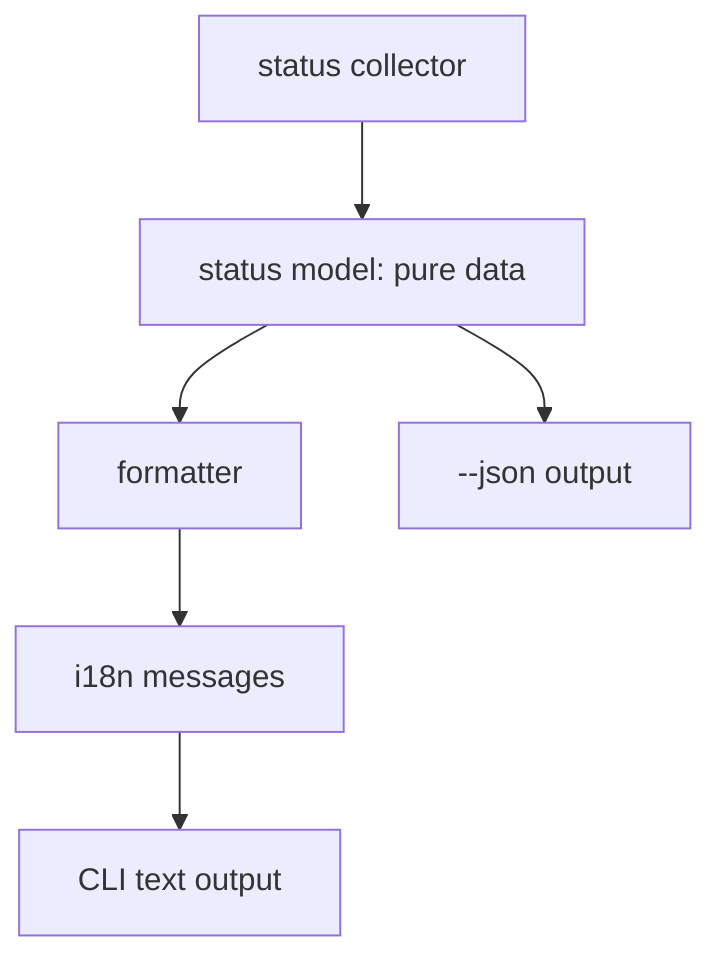

# Issue 018 — `echoctl status`、Help 与国际化输出

## 背景

Echo 已经有 `serve`、`stop`、`doctor`、`capture status`、MCP 配置等能力，但普通用户在命令行里缺少一个总入口来回答：

- Echo 服务现在有没有跑？
- 网页地址在哪里？
- API 地址在哪里？
- 当前目录是否已注册为 Echo 项目？
- 自动收集是否开启？
- Claude hook 是否安装？
- MCP 是什么，怎么接？
- 有没有 legacy 待处理会话？

同时，用户希望命令行输出默认中英文双语，并且从一开始为国际化扩展留结构。

## 决策

新增 `echoctl status`，作为普通用户查看当前 Echo 状态的主入口。

新增或完善 help：

- `echoctl --help`
- `echo-mcp --help`
- `echoctl mcp --help`
- `echo-mcp mcp --help`

输出层必须从一开始分离为：



## 命令定位

| 命令 | 定位 |
|---|---|
| `echoctl status` | 普通用户状态总览 |
| `echoctl doctor` | 开发/排障级健康检查 |
| `echoctl capture status` | 低层 capture 状态，保留但弱化 |
| `echoctl project list` | 项目注册列表 |
| `echoctl mcp --help` | MCP 说明与配置帮助 |

## `echoctl status` 输出内容

### 必须包含

| 模块 | 字段 | 说明 |
|---|---|---|
| Serve / 服务 | running/stopped | 是否有 serve 进程 |
| Serve / 服务 | Docs URL | VitePress 页面地址 |
| Serve / 服务 | API URL | 本地 API 地址 |
| Serve / 服务 | PID / startedAt / log | 排障信息 |
| Capture / 收集 | on/off | 是否自动收集 AI 会话 |
| Hook / 钩子 | Claude installed/missing/legacy | 判断为什么没有记录 |
| Project / 当前项目 | registered/unregistered | 当前 cwd 是否注册 |
| Project / 当前项目 | projectId/root/dataRoot | 当前项目路由信息 |
| Data / 数据 | live buffers/articles/comments | 当前项目数据概览 |
| Legacy / 历史待处理 | legacy buffer count | 顶层 legacy 是否有内容 |
| Legacy / 历史待处理 | current project candidates | 是否有当前项目可迁移候选 |
| MCP / AI 访问接口 | config command/tools count | 给零基础用户提示 MCP 能力 |
| Next / 下一步 | suggested action | 根据状态给最重要的一句话 |

### 示例输出

```text
Echo status / Echo 状态

Serve / 服务
  Status / 状态        running / 运行中
  Docs / 文档地址      http://127.0.0.1:5173/
  API / 接口地址       http://127.0.0.1:8787/
  PID / 进程号         12345
  Log / 日志           /Users/me/.echo-workspace/.serve.log

Capture / 收集
  Status / 状态        on / 开启
  Claude hook / Claude 钩子  installed / 已安装

Current project / 当前项目
  Status / 状态        registered / 已注册
  Project / 项目       myechotestv2
  Root / 根目录        /Users/me/myechotestv2
  Data / 数据目录      /Users/me/.echo-workspace/projects/myechotestv2

Data / 数据
  Live buffers / 实时会话缓存     1
  Articles / 文章                3
  Comments / 评论                0
  Legacy buffers / legacy 会话    2
  Legacy candidates / 当前项目候选 1

MCP / AI 访问接口
  Config / 配置        echoctl mcp
  Tools / 工具         9 available / 9 个可用

Next / 下一步
  Open Docs / 打开网页: http://127.0.0.1:5173/
  Review legacy candidates in the web UI.
  请在网页中确认是否迁移 legacy 会话。
```

## `--json`

`echoctl status --json` 必须输出纯数据，给页面、脚本和 AI agent 使用，不应要求解析人类文本。

示例：

```json
{
  "serve": {
    "running": true,
    "docsUrl": "http://127.0.0.1:5173/",
    "apiUrl": "http://127.0.0.1:8787/",
    "pid": 12345,
    "logFile": "/Users/me/.echo-workspace/.serve.log"
  },
  "capture": {
    "enabled": true
  },
  "hook": {
    "provider": "claude",
    "installed": true,
    "legacyHooks": []
  },
  "project": {
    "registered": true,
    "projectId": "myechotestv2",
    "root": "/Users/me/myechotestv2",
    "dataRoot": "/Users/me/.echo-workspace/projects/myechotestv2"
  },
  "data": {
    "liveBuffers": 1,
    "articles": 3,
    "comments": 0
  },
  "legacy": {
    "buffers": 2,
    "currentProjectCandidates": 1
  },
  "mcp": {
    "command": "echoctl",
    "args": ["mcp"],
    "toolCount": 9
  },
  "nextActions": [
    {
      "kind": "open_docs",
      "label": "Open Docs",
      "url": "http://127.0.0.1:5173/"
    }
  ]
}
```

## 国际化设计

### 默认语言策略

| 输入 | 输出 |
|---|---|
| `echoctl status` | 默认双语 |
| `echoctl status --lang zh-CN` | 中文 |
| `echoctl status --lang en` | 英文 |
| `ECHO_LANG=zh-CN echoctl status` | 中文 |
| `echoctl status --json` | 不走翻译文案 |

### 消息组织

建议结构：

```text
scripts/lib/i18n/
  messages/
    en.js
    zh-CN.js
    bilingual.js
  format.js
```

消息 key 示例：

```js
{
  "status.title": "Echo status",
  "section.serve": "Serve",
  "field.docs": "Docs",
  "value.running": "running",
  "next.reviewLegacy": "Review legacy candidates in the web UI."
}
```

双语输出不建议手写每一整句，而是通过同一 key 同时取英文和中文：

```text
Serve / 服务
Status / 状态
running / 运行中
```

### 格式化原则

- 不把文案散落在 usecase 或 CLI switch 里。
- collector 只返回数据，不负责语言。
- formatter 不读取文件系统，只接收 status model 和 lang。
- `--json` 不带中英文展示字段。

## `echoctl --help`

普通 help 应回答“Echo 是什么”和“下一步怎么做”。

示例结构：

```text
Echo / 本地 AI 对话知识库

Echo captures AI coding conversations into a local, searchable archive.
Echo 会把 AI 编程对话保存为本地、可搜索、可标注的知识库。

Common commands / 常用命令
  echoctl serve                 Start web UI / 启动网页
  echoctl status                Show current status / 查看当前状态
  echoctl init project          Register current project / 注册当前项目
  echoctl hook install claude --write
                                Install Claude hook / 安装 Claude 钩子
  echoctl stop                  Stop Echo serve / 停止服务

AI access / AI 访问
  echoctl mcp --help            Learn MCP setup / 查看 MCP 配置说明

Troubleshooting / 排障
  echoctl doctor                Run health checks / 运行健康检查
```

`echo-mcp --help` 应显示相同帮助，但附加提醒：

```text
echo-mcp is still supported, but echoctl is the preferred command.
echo-mcp 仍可使用，但推荐改用 echoctl。
```

## `echoctl mcp --help`

MCP 对用户是零基础概念，help 必须用人话解释。

建议文案：

```text
Echo MCP / Echo AI 访问接口

MCP is the bridge that lets AI assistants read and search your Echo archive.
MCP 是让 AI 助手读取、搜索 Echo 本地归档的桥。

What it provides / 它提供：
  - search_articles    Search Echo articles / 搜索文章
  - get_article        Read one article / 读取文章
  - get_article_context
                       Read article with comments / 读取文章和评论
  - list_recent        List recent articles / 最近文章
  - list_tags          List tags / 标签列表
  - add_tags           Add tags / 添加标签
  - remove_tags        Remove tags / 移除标签
  - list_projects      List registered projects / 项目列表
  - get_project        Read one project / 读取项目信息

Config / 配置：

{
  "mcpServers": {
    "echo": {
      "command": "echoctl",
      "args": ["mcp"]
    }
  }
}

Verify / 验证：
  echoctl status        Check Echo status / 查看 Echo 状态
  echoctl doctor        Diagnose setup / 诊断配置
```

## 网页 MCP 弹窗同步

网页里的 MCP 配置弹窗应该复用同一套说明，而不是只给 JSON。

建议增加：

- “MCP 是什么？”一句解释。
- “复制配置”按钮。
- “如何验证？”短提示：`echoctl status` / `echoctl doctor`。

## 验收标准

- `echoctl status` 在 serve 运行和未运行时都可用。
- `echoctl status --json` 输出稳定结构。
- 默认文本输出为中英文双语。
- `--lang zh-CN` 和 `--lang en` 能切换单语言输出。
- `echoctl --help`、`echo-mcp --help` 可用。
- `echoctl mcp --help`、`echo-mcp mcp --help` 可用，并解释 MCP。
- 文案集中在 i18n message 层，不散落在业务逻辑里。

## 待确认

- v1 是否只实现 `status` 的双语输出，help 国际化后续再抽？
- `status --json` 中是否包含所有 doctor 结果，还是只包含摘要？
- MCP tool count 是否从 tools schema 动态读取，避免文档和实现不同步？

