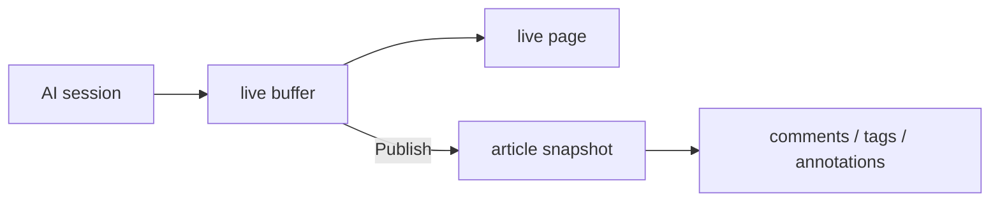
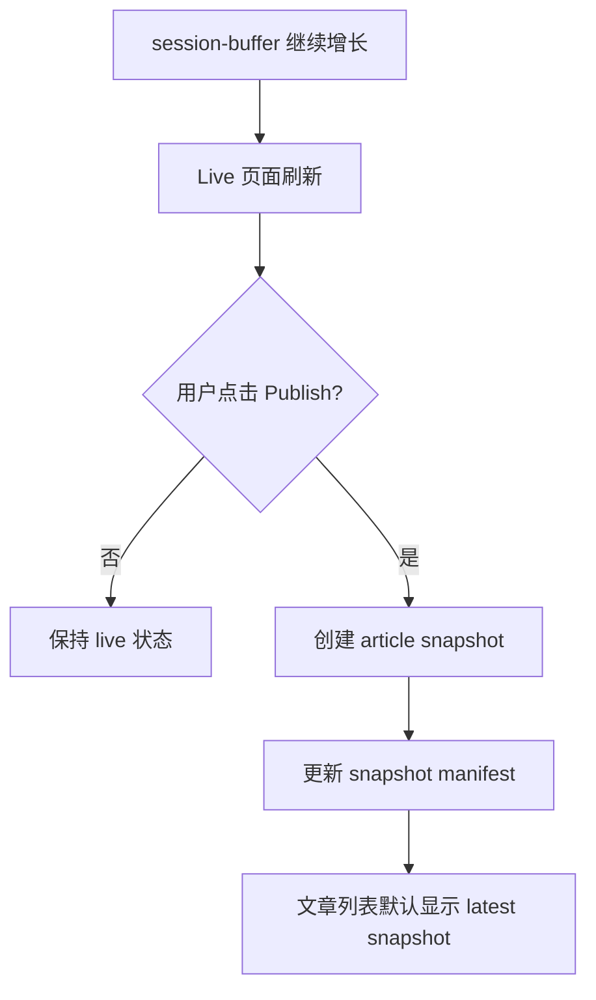
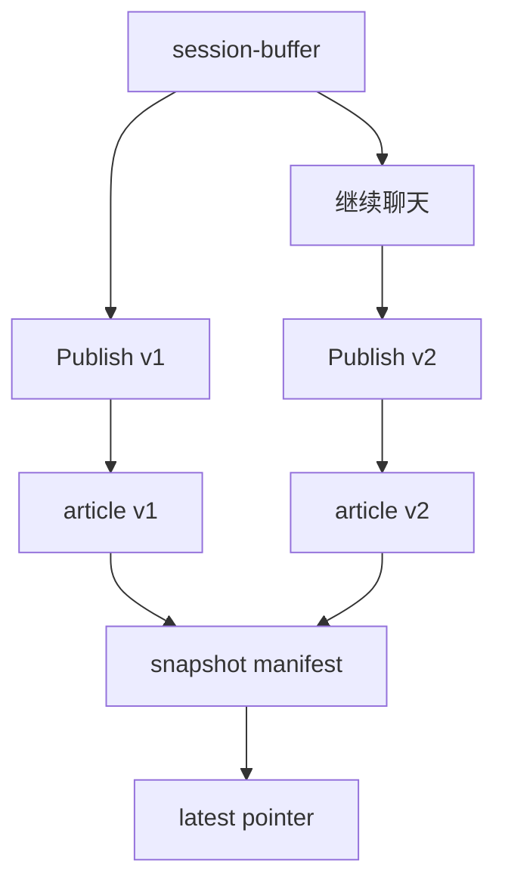

# Issue 019 — Publish 定义、会话增长与文章版本模型

## 背景

Echo 早期有一个强原则：

> 文章正文一旦创建，用户、agent、importer、validator、MCP 工具均不得修改。

随着 live session 引入，需要修正这个原则的精确对象。用户可能回到旧 AI 会话继续聊天。此时 Echo 页面应能显示新增内容，但这不应该等价于“悄悄修改已发布文章正文”。

因此需要重新定义：

- 什么是 session？
- 什么是 live buffer？
- 什么是 publish？
- 新 publish 后旧 article 怎么处理？

## 核心定义

### Session

真实 AI 会话。用户可以回到旧 Claude/Codex 会话继续聊天，所以 session 是可以继续增长的。

### Live buffer

Echo 捕获到的 session 当前内容，保存在 `projects/<project-id>/session-buffer/`。它是可追加的工作区状态，不是正式文章。

### Publish

发布不是发到互联网，也不是公开给别人。

> 发布 = 把一个仍在增长的 AI 会话，固定成一个可引用、可评论、可检索的历史快照。

### Article

Article 是 publish 之后的快照。它的正文不可变。后续评论、标注、标签、摘要、版本关系都属于外部层。



## 修正后的不可变原则

旧表述：

> Echo 的文章是不可变的 AI 对话转写。

建议新表述：

> Echo 的 live session 可以继续增长；已发布 article 是某一时刻的快照，正文不可变。

更完整：

> Echo 不修改已经发布的文章正文。用户回到旧 AI session 继续聊天时，Echo 应追加 live buffer 并刷新 live/latest 页面；如果用户希望固定新增内容，需要再次 publish，生成新的 article 快照版本。

## 页面类型

| 页面类型 | 示例 URL | 是否可变 | 说明 |
|---|---|---:|---|
| Live session | `/live/generated/<project>--<session>` | 是 | 展示最新 buffer，可随聊天增长 |
| Published article | `/articles/generated/<project>--<article>` | 否 | 某次 publish 的快照 |
| Latest session view | 可选 `/sessions/generated/<project>--<session>` | 是 | 永远显示该 session 最新状态 |

v1 可以只保留 live + article 两种页面。

## publish 行为



关键规则：

1. Echo 不自动 publish。
2. `serve` 可以自动刷新 live 页面。
3. `echoctl all` 不应继续隐式把所有 buffer 转成正式 article。
4. 用户确认 publish 后，才生成 article。
5. publish 永远 create 新快照，不 overwrite 旧 article。

## 旧 article 怎么处理

当同一个 session 发布新 article 后：

| 对象 | 处理 |
|---|---|
| 旧 article v1 | 保留，不改正文 |
| 新 article v2 | 新建，成为 latest |
| 版本关系 | 由外部 manifest 管理 |
| 列表页 | 默认只显示 latest，可切换显示历史版本 |
| 文章详情页 | 显示版本切换器 |
| 评论/标注 | 默认绑定具体 article 版本 |



## Snapshot manifest

为了避免回写旧 article frontmatter，版本关系应放在外部 manifest。

建议文件：

```text
projects/<project-id>/snapshots.json
```

示例：

```json
{
  "sessions": {
    "claude-session-abc": {
      "projectId": "myechotestv2",
      "latestArticleId": "session-2026-05-28-v2",
      "versions": [
        {
          "version": 1,
          "articleId": "session-2026-05-28-v1",
          "publishedAt": "2026-05-28T10:00:00.000Z",
          "turnCount": 10
        },
        {
          "version": 2,
          "articleId": "session-2026-05-28-v2",
          "publishedAt": "2026-05-28T11:00:00.000Z",
          "turnCount": 18
        }
      ]
    }
  }
}
```

### 为什么不用回写旧 frontmatter

不建议把 v1 的 `latest: false`、`next: v2` 写回旧文章，因为：

- 会破坏“已发布正文与元数据尽量稳定”的心理模型。
- 需要更新旧文件，增加并发和审计复杂度。
- 版本关系本来就是外部索引，适合放 manifest。

如果未来允许修改 frontmatter，也应只在显式 metadata migration 中做，不在 publish 流程里偷偷做。

## Article frontmatter 建议

新发布 article 的 frontmatter 可以包含快照自身信息：

```yaml
id: session-2026-05-28-v2
type: article
project: myechotestv2
source:
  kind: live_session
  session_id: claude-session-abc
snapshot:
  version: 2
  published_at: "2026-05-28T11:00:00.000Z"
  turn_count: 18
```

不要要求旧 article 后续被更新。

## 评论与标注

默认规则：

> 评论和标注绑定具体 article 版本，不自动迁移到新版。

原因：

- anchor 对某个快照正文成立。
- 新版本虽然通常只是追加内容，但也可能因为转换策略变化导致位置不同。
- 自动复制评论可能制造误导。

未来可选能力：

| 操作 | 行为 |
|---|---|
| 带评论发布新版 | 尝试复制可解析 anchor |
| anchor 可解析 | 复制评论并标记来源 |
| anchor 不可解析 | 标记 `needs_review` |
| 用户手动确认 | 再写入新版评论 |

## 列表与详情页

### 文章列表

默认只显示每个 session 的 latest published snapshot。

可以提供筛选：

| 筛选 | 说明 |
|---|---|
| Latest | 默认，只看最新快照 |
| All versions | 显示所有历史版本 |
| Live sessions | 显示未发布或有新增内容的 live |

### 文章详情页

如果当前 article 不是 latest：

```text
This is version 1. A newer snapshot is available: version 2.
这是第 1 版。已有更新快照：第 2 版。
```

如果当前 article 是 latest，但 live buffer 又有新 turn：

```text
This article has new live updates. Publish a new snapshot?
这篇文章对应的会话已有新内容。是否发布新快照？
```

## CLI/API 草案

### CLI

```bash
echoctl publish <session-id>
echoctl publish <session-id> --project <project-id>
echoctl publish <session-id> --message "optional note"
echoctl snapshots list <session-id>
```

### API

`POST /api/publish`

```json
{
  "projectId": "myechotestv2",
  "sessionId": "claude-session-abc"
}
```

返回：

```json
{
  "ok": true,
  "articleId": "session-2026-05-28-v2",
  "version": 2,
  "latest": true
}
```

## 当前管线需要调整

当前或早期设计中，`echoctl all` / `serve` 可能自动把 buffer convert 成 article。这与新 publish 定义冲突。

目标状态：

| 当前行为 | 目标行为 |
|---|---|
| `serve` 自动 convert buffer 为 article | `serve` 自动刷新 live page |
| `echoctl all` 自动发布所有 buffer | `echoctl all` 只处理已发布 article 的 validate/index/resolve，或另设 legacy 兼容模式 |
| `convert` 是常规管线一环 | `publish` 才会调用 snapshot conversion |

迁移期可保留旧命令，但需要在文档和输出里明确：

```text
convert is a legacy publishing path. Prefer echoctl publish.
convert 是旧的发布路径，建议使用 echoctl publish。
```

## 验收标准

- live session 继续增长时，页面能显示新内容。
- 已发布 article 不被静默覆盖。
- 再次 publish 会创建新 article snapshot。
- 旧 article 仍可访问。
- 列表默认显示 latest snapshot。
- 详情页能显示版本关系。
- 评论和标注默认不自动迁移版本。
- `echoctl all` 不再无意发布 live buffer。

## 待确认

- `session_id` 使用 Claude 原始 session id，还是 Echo buffer 文件名？
- article id 是否采用 `session-YYYY-MM-DD-vN`，还是 `session-id-snapshot-N`？
- 是否需要“废弃旧版本”状态，还是所有历史版本永远可见？
- 未发布 live session 是否参与全文搜索？

