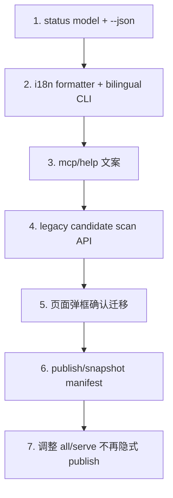

# Issue 020 — 下一阶段实现交接清单

## 背景

本文件把 Issue 017、018、019 整理成可执行的交接清单。目标是让后续实现者先按文档拆任务，不凭聊天记录补脑。

当前约定：

> 这些是设计文档，不代表立即实现。实现前需要确认任务范围。

## 相关文档

| Issue | 主题 |
|---|---|
| [017](017-capture-lifecycle-and-legacy-recovery.md) | Capture 生命周期与 legacy 恢复 |
| [018](018-echoctl-status-help-i18n.md) | `echoctl status`、Help 与国际化输出 |
| [019](019-publish-snapshot-version-model.md) | Publish 定义、会话增长与文章版本模型 |

## 推荐实施顺序

## Phase 1 — `echoctl status`

### 范围

- 新增 status collector。
- 新增 `echoctl status`。
- 支持 `--json`。
- 默认双语输出。

### 不做

- 不改 capture 行为。
- 不改 publish 行为。
- 不重做 `doctor`。

### 验收

- serve 停止时能显示 stopped。
- serve 运行时显示 Docs/API URL。
- 当前目录注册与否能显示。
- capture on/off 能显示。
- `--json` 输出稳定结构。

## Phase 2 — Help 与 MCP 说明

### 范围

- `echoctl --help`
- `echo-mcp --help`
- `echoctl mcp --help`
- `echo-mcp mcp --help`
- 网页 MCP 弹窗补一句“这是什么”。

### 验收

- 用户不知道 MCP 是什么，也能看懂它是“AI 访问 Echo 的桥”。
- 配置 JSON 仍然可复制。
- help 中推荐 `echoctl`，但说明 `echo-mcp` 兼容。

## Phase 3 — Legacy 候选恢复

### 范围

- 后端扫描 legacy candidates。
- 只返回当前项目相关候选。
- 页面弹框。
- 用户确认后迁移。
- 迁移后 refresh。

### 不做

- 不迁移所有 legacy。
- 不自动删除 legacy。
- 不自动 publish。

### 验收

- 未注册项目误入 legacy 后，注册项目并打开页面能看到恢复提示。
- 只有当前项目相关候选被列出。
- 点击确认后进入 project session-buffer。
- 后续同 session 继续聊天会追加到 project session-buffer。

## Phase 4 — Publish 与 snapshot 版本

### 范围

- 定义 publish usecase。
- 新增 snapshot manifest。
- 再次 publish 生成新版本。
- 列表默认 latest。
- 详情页显示版本关系。

### 不做

- 不自动迁移评论到新版。
- 不静默覆盖旧 article。
- 不回写旧 article frontmatter。

### 验收

- article v1 保留。
- publish v2 后 v2 成为 latest。
- v1 可访问。
- live 有新内容时提示可发布新快照。

## 风险点

| 风险 | 说明 | 建议 |
|---|---|---|
| legacy 误迁移 | 错把其他项目会话迁到当前项目 | 必须要求 transcript_path/cwd 证据 |
| session-map 断裂 | 旧 session 继续聊天时写到新文件 | 迁移时同步 session-map |
| 自动 publish 破坏模型 | `serve/all` 继续隐式 convert | 先文档标记，再逐步改命令 |
| i18n 散落 | 中英文字符串写满 CLI | 先建 message 层 |
| 版本关系污染 article | 为 latest 回写旧 frontmatter | 用 manifest 管版本 |

## 给实现者的注意事项

- 优先写 usecase 测试，再接 CLI/API。
- 页面交互必须以用户确认作为迁移前置条件。
- 文档中的命令/API 是草案，实现前可以调整命名，但语义不能变。
- 不要在 validate、index、resolve 阶段修改 article 正文。
- 不要把 legacy 迁移和 publish 合并成一个动作。

