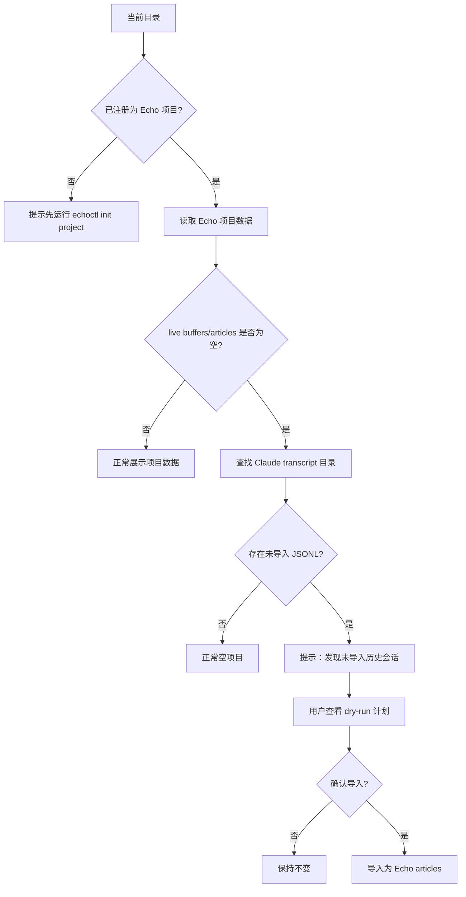
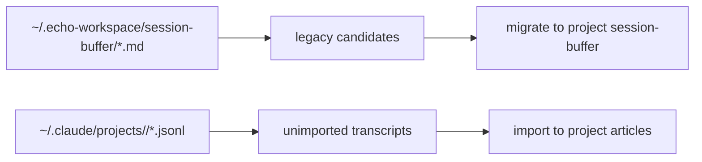

# Issue 021 — 未导入 Claude 历史会话发现与提示

## 背景

用户可能先在某个工程目录里和 AI 进行了很多轮对话，之后才想起运行：

```bash
echoctl serve
echoctl init project
```

此时 Claude Code 的原始 transcript 已存在于：

```text
~/.claude/projects/<encoded-project-path>/*.jsonl
```

但 Echo 项目数据目录仍然为空：

```text
~/.echo-workspace/projects/<project-id>/session-buffer/
~/.echo-workspace/projects/<project-id>/articles/
```

这会造成困惑：

- `echoctl status` 显示当前项目 live buffers/articles 都是 0。
- 页面看不到这个项目的会话或文章。
- 用户容易误以为 legacy buffer 迁移坏了。

实际原因是：这些会话还没有进入 Echo。它们既不是 project live buffer，也不是 legacy buffer，而是 Claude provider 的未导入历史 transcript。

## 核心定义

新增一类状态：

> Unimported Claude transcripts / 未导入 Claude 历史会话

它和 legacy buffer 必须分开。

| 类型 | 来源 | 含义 | 处理方式 |
|---|---|---|---|
| live buffer | Echo hook 实时捕获 | Echo 已记录，但还没发布为文章 | convert / publish |
| article | Echo articles | 已进入 Echo 页面与 MCP | 正常展示 |
| legacy buffer | Echo 旧路径误捕获 | 已经是 Echo 数据，但放错项目目录 | migrate legacy |
| unimported transcript | Claude `.jsonl` | Echo 开启前或未捕获的历史对话 | import claude |

## 产品目标

- 当前项目已注册，但 Echo 数据为空时，主动检查是否存在对应 Claude transcript。
- 在 `echoctl status` 和网页中提示“发现未导入历史会话”。
- 用户确认后才导入。
- 不把该状态混入 legacy candidates。
- 不自动导入，不自动删除 Claude 原始 transcript。

## 非目标

- 不改变文章不可变原则。
- 不在 validate/index/resolve 阶段导入 transcript。
- 不把所有 Claude 历史会话自动扫进当前项目。
- 不把 transcript import 和 legacy migration 合并成一个动作。
- 不解决所有 provider；本 issue 只覆盖 Claude Code。

## 总体流程



## 路径匹配规则

当前项目 root：

```text
/Users/vincenthuang/ruoyi-vue-pro
```

对应 Claude project dir：

```text
~/.claude/projects/-Users-vincenthuang-ruoyi-vue-pro/
```

匹配规则应复用或扩展现有 import scanner：

- 根据当前 Echo project root 编码得到 Claude project dir name。
- 只扫描该目录下的 `.jsonl`。
- 若目录不存在，返回 0。
- 若 import manifest 已记录相同 session hash，则不算未导入。
- 若 session hash 变化，可标为 updated。

## `echoctl status` 展示

新增字段建议：

```json
{
  "transcripts": {
    "provider": "claude-code",
    "projectDir": "/Users/vincenthuang/.claude/projects/-Users-vincenthuang-ruoyi-vue-pro",
    "total": 1,
    "new": 1,
    "updated": 0,
    "skipped": 0
  }
}
```

人类输出建议：

```text
Claude history / Claude 历史会话
  Unimported / 未导入     1
  Updated / 有更新        0

Next / 下一步
  Found Claude chat history that has not been imported into Echo.
  发现当前项目有尚未导入 Echo 的 Claude 历史会话。
```

## 页面展示

项目为空但存在未导入 transcript 时，页面应显示一个明确入口：

```text
发现 1 个未导入的 Claude 历史会话
这些对话存在于 Claude Code 的原始记录中，但还没有进入 Echo。

[查看导入计划] [稍后处理]
```

查看导入计划后展示：

| 字段 | 说明 |
|---|---|
| session id | Claude JSONL 文件名 |
| modified time | 文件修改时间 |
| estimated turns | provider classification 估算 |
| status | new / updated / skipped |
| article id | 导入后预计生成的 article id |

## API 草案

### GET `/api/import/claude-candidates?projectId=<id>`

返回当前项目的 Claude transcript 导入候选。

```json
{
  "projectId": "ruoyi-vue-pro",
  "provider": "claude-code",
  "projectDir": "/Users/vincenthuang/.claude/projects/-Users-vincenthuang-ruoyi-vue-pro",
  "summary": {
    "total": 1,
    "new": 1,
    "updated": 0,
    "skipped": 0
  },
  "candidates": [
    {
      "sessionId": "b8cfacc9-dd02-474f-a4fb-783432810890",
      "filePath": "/Users/vincenthuang/.claude/projects/-Users-vincenthuang-ruoyi-vue-pro/b8cfacc9-dd02-474f-a4fb-783432810890.jsonl",
      "status": "new",
      "articleId": "session-b8cfacc9"
    }
  ]
}
```

### POST `/api/import/claude`

只导入用户确认的候选，不重新扩大范围。

```json
{
  "projectId": "ruoyi-vue-pro",
  "sessionIds": ["b8cfacc9-dd02-474f-a4fb-783432810890"]
}
```

返回：

```json
{
  "ok": true,
  "imported": 1,
  "skipped": 0,
  "articlesDir": "/Users/vincenthuang/.echo-workspace/projects/ruoyi-vue-pro/articles",
  "refreshScheduled": true
}
```

## CLI 关系

现有命令：

```bash
echoctl import claude --project <claude-project-dir> --as-project <project-id> --dry-run
echoctl import claude --project <claude-project-dir> --as-project <project-id> --apply
```

建议新增更贴近用户的包装命令：

```bash
echoctl import claude --current-project --dry-run
echoctl import claude --current-project --apply
```

其语义：

- 从当前 cwd 找 Echo project。
- 根据 project root 找 Claude transcript 目录。
- 导入到当前 project articles。
- 写 import manifest 去重。

## 与 legacy recovery 的边界



边界规则：

- legacy recovery 处理 Echo 自己已经捕获的 `.md` buffer。
- transcript discovery 处理 Claude provider 的 `.jsonl` 原始记录。
- 两者都需要用户确认。
- 两者都不能自动修改已有 article 正文。
- 两者的 status/page 文案必须分开。

## 验收标准

- 在已注册但 Echo 数据为空的 `~/ruoyi-vue-pro` 下，`echoctl status` 能提示存在 1 个未导入 Claude transcript。
- 页面能在该项目卡片或空状态中提示“发现未导入历史会话”。
- 用户能先查看 dry-run 计划。
- 用户确认后，候选 session 导入为当前项目 article。
- 导入后再次打开 status/page，不再重复提示同一 session。
- legacy candidates 仍然只统计 `~/.echo-workspace/session-buffer/` 中可证明属于当前项目的 Echo buffer。

## 实施建议

1. 抽取 `discoverClaudeImportCandidates(projectId)` usecase。
2. 复用 import manifest 的 hash 去重能力。
3. 扩展 `status-collector` 增加 `transcripts` 字段。
4. 新增 API dry-run endpoint。
5. 页面空状态增加提示入口。
6. 最后再补 `--current-project` CLI 包装。

